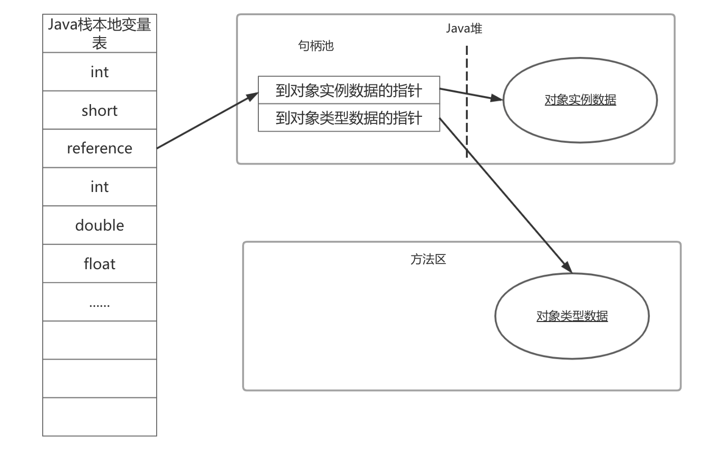

# Java内存区域与内存溢出异常
Java与C++之间有一堵由内存动态分配和垃圾收集技术围城的"高墙"，墙外的人想进去，墙里的人却想出来
## 概述
对于C、C++程序开发人员来说，在内存管理领域，既拥有每个对象的"所有权"，又担负着每一个对象生命开始到终结的维护责任

对于Java程序员，在虚拟机自动内存管理机制帮助下，不再需要为每个new操作写配对的delete/free代码，不容易出现内存泄漏和内存溢出问题，
由虚拟机管理内存。也正因为Java程序员把内存控制的权力交给了Java虚拟机，一旦出现内存泄漏和溢出方面的问题，如果不了解虚拟机是怎样使用
内存，那么排查错误将成为一项异常艰难的工作

## 运行时数据区域
Java虚拟机在执行Java程序的过程中会把它所管理的内存划分为若干个不同的数据区域。这些区域各有各的用途，以及创建和销毁的时间，有的区域
随着虚拟机进程的启动而存在，有些区域则依赖用户线程的启动和结束而建立和销毁。根据Java虚拟机规范规定，Java虚拟机所管理的内存将会包括
以下几个运行时数据区域


### 程序计数器
程序计数器是一块较小的内存空间，它可以看作是当前线程所执行的字节码的行号指示器。在虚拟机的概念模型里，字节码解释器工作时就是通过改变这
个计数器的值来选取下一条需要执行的字节码指令，分支、循环、跳转、异常处理、线程恢复等基础功能都需要依赖计数器完成

由于Java虚拟机的多线程是通过线程轮流切换并分配处理器执行时间的方式来运行，在任何一个确定时刻，一个处理器（对于多核处理器来说是一个内核）
都只会执行一条线程的指令。为了线程切换后能恢复到正确的执行位置，每条线程都需要一个独立的程序计数器，各线程之间计数器互不影响，独立存储，称
这类内存区域为"线程私有"内存

如果线程正在执行的是一个Java方法，这个计数器记录的是正在执行的虚拟机字节码指令的地址；如果正在执行的是Native方法，这个计数器则为空。此内存
区域是唯一一个在Java虚拟机规范中没有规则任何OutOfMemoryError情况的区域

### Java虚拟机栈
与程序计数器一样，Java虚拟机栈也是线程私有的，它的生命周期与线程相同。虚拟机栈描述的是Java方法执行的内存模型：每个方法在执行的同时会创建一个
栈帧用于存储局部变量表、操作数栈、动态链接、方法出口等信息。每个方法从调用直至执行完成的过程，就对应着一个栈帧在虚拟机栈中入栈到出栈的过程

将Java内存区分为堆内存和栈内存，这种方法比较粗糙，Java内存区域的划分实际比这复杂的多。这种划分只能说大多数程序员最关注与对象内存分配关系最
密切的这两块区域

局部变量表（即虚拟机栈）存放了编译期可知的各种基本数据类型、对象引用（reference类型，不等同于对象本身，可能是指向对象起始地址的引用指针，也可能
是指向一个代表对象的句柄或其他与此对象相关的位置）和returnAddress类型（指向一条字节码指令的地址）

64位长度long和double类型的数据会占用2个局部变量空间，其余的数据类型只占用1个。局部变量表所需的内存空间在编译期完成分配，当进入一个方法时，这个方
法需要在帧中分配多大的局部变量空间完成确定，在方法运行期间不会改变记不变量表的大小

在Java虚拟机规范中，对这两个区域规定了两种异常情况：如果线程请求的栈深度大于虚拟机所允许的深度，将抛出StackOverflowError异常；如果虚拟机栈可以
动态扩展（大部分Java虚拟机都可动态扩展，只不过Java虚拟机规范中也允许固定长度的虚拟机栈），如果扩展时无法申请到足够的内存，就会抛出OutOfMemoryError
异常。

### 本地方法栈
本地方法栈与虚拟机栈所发挥的作用是非常相似的，他们之间的区别是虚拟机栈为虚拟机执行Java方法（字节码）服务，本地方法栈则为虚拟机使用到的Native方法服务。
在虚拟机规范中对本地方法栈中方法使用的语言、使用方式与数据结构并没有强制规定，因此具体的虚拟机可以自由实现。甚至有的虚拟机（Sun HotSpot）直接将本地
方法和虚拟机栈合二为一。与虚拟机栈一样，本地方法栈区域也会抛出StackOverflowError和OutOfMemoryError异常。

### Java堆
对大多数应用来说，Java堆是Java虚拟机所管理的内存中最大的一块。Java堆是被所有线程共享的一块内存区域，在虚拟机启动时创建。此内存区域的唯一目的就是存放
对象实例，几乎所有的对象实例都在这里分配内存。在Java虚拟机规范中的描述是：所有的对象实例以及数组都要在堆上分配，但随着JIT编译器发展与逃逸分析技术逐渐
成熟，栈上分配、标量替换优化技术将会导致，所有对象都分配在堆上也渐渐变得不是那么绝对

Java堆是垃圾收集器管理的主要区域，因此很多时候也被称做"GC堆"。从内存回收的角度看，由于现在收集器基本都采用分代收集算法，所以Java堆中还可以细分为：
新生代和老年代；再细致可以分为Eden空间、From Survivor空间、To Survivor空间等。从内存分配的角度看，线程共享的Java堆中可能划分出多个线程私有的分配
缓存区。不管如何划分，都与存放内容无关，无论那个区域，存储的都仍然是对象实例，进一步划分的目的是为了更好的回收内存，或更快地分配内存

根据Java虚拟机规范的规定，Java堆可以处于物理上不连续的内存空间，只要逻辑上连续即可。在实现时，既可以实现成固定大小的，也可以是可扩展的，当前主流的虚
拟机都是按照可扩展来实现的（通过-Xmx和-Xms控制）。如果堆中没有内存完成实例分配，并且堆也无法扩展时，将会抛出OutOfMemoryError异常

### 方法区
方法区与Java堆一样，是各个线程共享的内存区域，它用于存储已被虚拟机加载的类信息、常量、静态变量、即使编译后的代码等数据。虽然Java虚拟机规范把方法区描述
为堆的一个逻辑部分，但它却有一个别名叫Non-Heap（非堆）

对于习惯在HotSpot虚拟机上开发、部署程序的开发者来说，很多人更愿意把方法区叫做"永久代"，仅因为HotSpot虚拟机设计团队选择把GC分代收集扩展至方法区，或者
说使用永久代来实现方法区，这样HotSpot的垃圾收集器可以像管理Java堆一样管理这部分内存，省去专门为方法区编写内存管理代码的工作。对于其他虚拟机来说是不存在
永久代的概念。如何实现方法区属于虚拟机实现细节，不受虚拟机规范约束，但使用永久代来实现方法区，目前看来并不明智，因为这样会更容易遇到内存溢出问题（永久代有
-XX:MaxPermSize）的上限，J9和JRockit只要没有触碰到进程可用内存上限，例如32位系统中的4GB，就不会出现问题），而且有极少数方法（例如String.intern()）
会因为这个原因导致不同虚拟机下有不同表现。HotSpot虚拟机也在逐步放弃永久代改用Native Memory，字符串常量池在JDK 1.7之后已经从永久代移除

Java虚拟机规范对方法区的限制非常宽松，除了和Java堆一样不需要连续的内存和可以选择固定大小或者扩展外，还可以选择不实现垃圾收集。垃圾收集行为在这个区域
是比较少出现的，但并非数据进入方法区就永久存在，这区域的内存回收目标主要是针对常量池的回收和对类型的卸载，这个区域的回收"成绩"一般难以令人满意，尤其是
类型的卸载，条件相当苛刻，但这部分区域的回收确实是必要的。因为对此区域回收不完全可能会导致内存泄漏

根据Java虚拟机规范的规定，当方法区无法满足内存分配需求时，将抛出OutOfMemoryError异常

### 运行时常量池
运行时常量池是方法区的一部分。Class文件中除了有类的版本、字段、方法、接口等描述信息外，还有一项信息是常量池，用于存放编译期生成的各种字面量和符号引用，
这部分内容将在类加载后进入方法区的运行时常量池中存放

Java虚拟机对Class文件每部分的格式都是严格规定，每个字节用于存储哪种数据都必须符合规范上的要求才会被虚拟机认可、装载和执行，对于运行时常量池，Java虚
拟机规范没有做任何细节的要求，不同的提供商实现的虚拟机可以按照自己的需求来实现这个内存区域。通常除了保存Class文件中描述的符号引用外，还会把翻译出来的
直接引用也存储在运行时常量池中

运行时常量池相对于Class文件常量池另一个重要特征就是具备动态性，Java语言并不要求常量一定只有编译期才能产生，也就是并非预置于Class文件中常量池的内容才
能进入方法区运行时常量池，运行期间也可能将新的常量放入池中，这种特性被开发人员用的最多的就是使用String类的intern()方法

既然运行时常量池是方法区的一部分，自然收到方法区内存的限制，当常量池无法再申请到内存时会抛出OutOfMemoryError异常

### 直接内存
直接内存并不是虚拟机运行时数据区的一部分，也不是Java虚拟机规范中定义的内存区域。但这部分内存也被频繁地使用，并且可能导致OutOfMemoryError异常出现

JDK 1.4中新加入了NIO类，引入了一种基于通道与缓冲区的I/O方式，可以使用Native函数库直接分配堆外内存，然后通过一个存储在Java堆中的DirectByteBuffer
对象作为这块内存的引用进行操作。这样能在一些场景中显著提高性能，避免在Java堆和Native堆中来回复制数据

本机直接内存的分配不会受到Java堆大小的限制，但会受到本机总内存（包括RAM以及SWAP区或者分页文件）大小以及处理器寻址空间的限制。服务器管理员在配置虚拟机参数
时，会根据实际内存设置-Xmx等参数信息，但经常忽略直接内存，使得各个内存区域总和大于物理内存限制，从而导致动态扩展时出现OutOfMemoryError异常

可以通过 -XX:MaxDirectMemorySize 参数来设置最大可用直接内存，如果启动时未设置则默认为最大堆内存大小，即与 -Xmx 相同。即假如最大堆内存为1G，则
默认直接内存也为1G，那么 JVM 最大需要的内存大小为2G多一些。当直接内存达到最大限制时就会触发GC，如果回收失败则会引起OutOfMemoryError

## HotSpot虚拟机对象
本小节将介绍HotSpot虚拟机Java堆中对象分配、布局和访问的全过程

### 对象创建
Java是一门面向对象的编程语言，在Java程序运行过程中无时无刻都有对象被创建出来。在语言层面上，创建对象通常仅是一个new关键字，在虚拟机中，对象（仅限于
普通Java对象，不包括数组和Class对象）的创建过程如下

虚拟机遇到一条new指令时，首先将去检查这个指令的参数是否能在常量池中定位到一个类的符号引用，并且检查这个符号引用代表的类是否已被加载、解析和初始化过。
如果没有必须先执行相应的类加载过程

在类加载检查通过后，接下来虚拟机将为新生对象分配内存。对象所需内存的大小在类加载完成后便可完全确定，为对象分配空间的任务等同于把一块确定大小的内存从Java
堆中划分出来。假设Java堆中内存是绝对规整的，所有用过的内存都放在一边，空闲的内存放在另一边，中间放着一个指针作为分界点的指示器，分配内存就仅仅是把指针向
空闲空间挪动一段与对象大小相等的距离，这种分配方式称为"指针碰撞"。如果Java堆中的内存并不是规整的，已使用的内存和空闲内存相互交错，分配内存将不能简单的
进行指针碰撞，虚拟机必须维护一个列表，记录哪些内存块是可用的，在分配的时候从列表中找到一块足够大的空间划分给对象实例，并更新列表上的记录，这种分配方式
称为"空闲列表"。选择使用哪种方式由Java堆是否规整决定，而Java堆是否规整又和采用的垃圾收集器是否带有压缩整理功能决定。因此在使用serial、ParNew
等带Compact过程的收集器时，系统采用的分配算法是指针碰撞，使用CMS这种基于Mark-Sweep算法的收集器时，采用空闲列表

除如何划分可用空间外，还需要考虑到对象创建在虚拟机中是非常频繁的行为，即使是修改一个指针所指向的位置，在并发情况下也不是线程安全的，可能出现
正在给对象A分配内存，指针还没有来得及修改，对象B又同时使用了原来的指针分配内存的情况。解决这个问题有两种方案

- 对分配内存空间的动作进行同步处理：实际上虚拟机采用CAS配上失败重试的方式保证更新操作的原子性

- 本地线程分配缓冲：把内存分配动作按照线程划分在不同的空间之中进行，即每个线程在Java堆中预先分配一小块内存，称为本地线程分配缓冲（TLAB）。
哪个线程要分配内存，就在哪个线程的TLAB上分配，只有TLAB用完并分配新的TLAB时，才需要同步锁定。虚拟机是否使用TLAB，可以通过-XX:+/-UseTLAB
  参数来设定
  
内存分配完成后，虚拟机需要将分配到的内存空间都初始化为零值，但不包括对象头，如果使用TLAB，这一过程也可以提前至TLAB分配时进行。这一步操作
保证了对象的实例字段在Java代码中可以不赋值就直接使用，程序能访问到这些字段的数据类型所对应的零值

虚拟机要对对象进行必要的设置，例如这个对象是哪个类的实例、如何才能找到类的元数据信息、对象的哈希码、对象的GC分代年龄等信息。这些信息存放在
对象的对象头之中。根据虚拟机当前的运行状态不同，如是否启用偏向锁等，对象头会有不同的设置方式

以上工作都完成后，从虚拟机的角度看，一个新的对象已经产生，但从Java程序的角度看，对象才刚刚开始，<init>方法还没有执行，所有的字段都还为零。
根据字节码中是否跟随invokespecial指令决定，执行new指令之后是否会执行<init>方法，当执行<init>方法会按程序员的意愿进行初始化，这样一个真正
可用的对象才算完全产生出来
> JVM提供了5种方法调用指令
> - invokestatic：该指令用于调用静态方法，即使用 static 关键字修饰的方法；
> - invokespecial：该指令用于三种场景：调用实例构造方法，调用私有方法（即private关键字修饰的方法）和父类方法（即super关键字调用的方法）；
> - invokeinterface：该指令用于调用接口方法，在运行时再确定一个实现此接口的对象；
> - invokevirtual：该指令用于调用虚方法（就是除了上述三种情况之外的方法）；
> - invokedynamic：在运行时动态解析出调用点限定符所引用的方法之后，调用该方法；在JDK1.7中推出，主要用于支持JVM上的动态脚本语言（如Groovy，Jython等
  
### 对象的内存布局
在HotSpot虚拟机中，对象在内存中存储的布局可以分为3块区域：对象头（Header）、实例数据<Instance Data>和对齐填充

HotSpot虚拟机的对象头包括两部分信息，第一部分用于存储对象自身的运行时数据，如哈希码（HashCode）、GC分代年龄、锁状态标志、线程持有的锁、
偏向线程ID、偏向时间戳等，这部分数据的长度在32位和64位的虚拟机（未开启压缩指针）中分别为32bit和64bit，官方称为"Mark Word"。对象需要存储
的运行时数据很多，其实已经超出了32位、64位Bitmap结构所能记录的限度，但是对象头信息是与对象自身定义的数据无关的额外存储成本，考虑到虚拟机
的空间效率，Mark Word被设计成一个非固定的数据结构以便在极小的空间内存存储尽量多的信息，它会根据对象的状态复用自己的存储空间。例，在32位HotSpot
虚拟机中，如果对象处于未被锁定的状态，Mark Word的32bit空间中25bit用于用于存储对象哈希码，4bit用于储存对象分代年龄，2bit用于存储标志位，
1bit固定为0，在其他状态（轻量级锁定、重量级锁定、GC标记、可偏向）下对象的储存如下

存储内容                           | 标志位    | 状态
--------------------------------- | -------- | -------------- 
对象哈希码、对象分代年龄             | 01       | 位锁定
指向锁记录的指针                    | 00       | 轻量级锁定
指向重量级锁的指针                  | 10       | 膨胀（重量级锁定）
空，不需要记录信息                  | 11       | GC标记
偏向线程ID、偏向时间戳、对象分代年龄  | 01       | 可偏向

对象头的另一部分是类型指针，即对象指向它的类元数据的指针，虚拟机通过这个指针来确定这个对象是哪个类的实例。并不是所有的虚拟机实现都必须在对象
数据上保留类型指针，也就是说查询对象的元数据信息并不一定要经过对象本身。如果对象是一个Java数组，那么对象头中还必须有一块用于记录数组长度
的数据，因为虚拟机可以通过普通Java对象的元数据信息确定Java对象的大小，但数组的元数据中却无法确定数组的大小

接下来的实例数据部分是对象真正存储的有效信息，也是程序代码中所定义的各种类型的字段内容。无论是从父类继承下来的，还是在子类中定义的，都需要记录
起来。这部分的存储顺序会受到虚拟机分配策略参数和字段在Java源码中定义顺序的影响。HotSpot虚拟机默认的分配策略为longs/doubles、ints、shorts/chars
、bytes/booleans、oops，从分配策略中可以看出，相同宽度的字段总是被分配到一起。在满足这个前提条件的情况下，在父类中定义的变量会出现在子类之前。
如果CompactFields参数值为true（默认true），那么子类中较窄的变量也可能被插入到父类变量的空隙中

第三部分对齐填充没有特殊含义，仅起占位符作用。由于HotSpot VM的自动内存管理系统要求对象起始地址必须是8字节的整数倍，也就是说对象的大小必须
是8字节的整数倍。对象头正好是8字节的整数倍，因此当对象实例数据部分没有对齐时，就需要通过对齐填充来补全

### 对象的访问定位
Java程序需要通过栈上的reference数据来操作堆上的具体对象。由于reference类型在Java虚拟机规范中只规定一个指向对象的引用，并没有定义这个引用
应该通过何种方式去定位、访问堆中的对象的具体位置，所以对象访问方式也是取决于虚拟机实现而定的。目前主流的访问方式有使用句柄和直接指针两种
- 如果使用句柄访，Java堆中将会划分出一块内存来作为句柄池，reference中存储的就是对象的句柄地址，而句柄中包含了对象实例数据与类型数据各自的
地址信息
  
  
- 如果使用直接指针访问，那么Java堆对象的布局中就必须考虑如何放置访问类型数据的相关信息，而reference中存储的直接就是对象地址
  

这两种对象访问方式各有优势，使用句柄来访问的最大好处就是reference中存储的是稳定的句柄地址，在对象被移动（垃圾收集时移动对象是非常普遍的行为）
时只会改变句柄中的实例数据指针，而reference本身不需要修改

使用直接指针访问方式的最大好处就是速度更快，能节省一次指针定位的时间开销，由于对象的访问在Java中非常频繁，因此积少成多也是一笔可观的执行成本。
HotSport使用的是直接指针访问方式，但从整个软件开发的范围看，各种语言和框架使用句柄访问的情况也十分常见

## OutOfMemoryError异常
Java虚拟机规范的描述中，除程序计数器外，虚拟机内存的其它几个运行时区域都有发生OutOfMemoryError异常的可能

### Java堆溢出
Java堆用于存储对象实例，只要不断地创建对象，并且保证GC Roots到对象之间有可达路径来避免垃圾回收机制清楚这些对象，那么在对象数量到达最大堆
的容量限制后就会产生内存溢出异常

代码限制Java堆的大小为20MB，不可扩展，通过参数-XX:+HeapDumpOnOutOfMemoryError可以让虚拟机在出现内存溢出异常时Dump出当前内存堆转存储
快照以便事后分析
```java
  /**
   * VM Args: -Xms20m -Xmx20m -XX:+HeapDumpOnOutOfMemoryError
   */
  public class HeapOOM {
      static class OOMObject{
      }
  
      public static void main(String[] args){
          List<OOMObject> list = new ArrayList<OOMObject>();
          while (true){
              list.add(new OOMObject());
          }
      }
  }
```
运行结果
```
  java.lang.OutOfMemoryError: Java heap space
  Dumping heap to java_pid39796.hprof ...
  Heap dump file created [27775259 bytes in 0.095 secs]
  Exception in thread "main" java.lang.OutOfMemoryError: Java heap space
      at java.util.Arrays.copyOf(Arrays.java:3210)
      at java.util.Arrays.copyOf(Arrays.java:3181)
      at java.util.ArrayList.grow(ArrayList.java:265)
      at java.util.ArrayList.ensureExplicitCapacity(ArrayList.java:239)
      at java.util.ArrayList.ensureCapacityInternal(ArrayList.java:231)
      at java.util.ArrayList.add(ArrayList.java:462)
      at main.java.org.aim.oom.HeapOOM.main(HeapOOM.java:16)
  
  Process finished with exit code 1

```

Java堆内存的OOM异常是实际应用中常见的内存溢出异常情况。当出现Java堆内存溢出时，异常信息栈信息java.lang.OutOfMemoryError会跟着进一步
提示Java heap space

要解决这个区域的异常，一般手段是通过内存映像分析工具对Dump出来的堆转存储快照进行分析，重点是确认内存中的对象是不是必要的，也就是先分清楚
到底出现内存泄漏还是内存溢出。以下是JProfile打开的堆转储快照文件


如果是内存泄露，可进一步通过工具查看泄露对象到GC Roots的引用链。就能找到泄露对象是通过怎样的路径与GC Roots相关联并导致垃圾收集器无法自动
回收他们。掌握了泄露对象的类型信息及GC Roots引用链信息，就可以比较准确地定位出泄露代码的位置

如果不存在泄露，应当检查虚拟机堆参数（-Xmx与-Xms），与机器物理内存对比看是否还可以调大，从代码上检查是否存在某些对象生命周期过长、持有状态
时间过长情况，尝试减少程序运行期内存消耗

### 虚拟机栈和本地方法栈溢出
由于HotSpot虚拟机中并不区分虚拟机栈和本地方法栈，对于HotSpot来说虽然-Xoss参数（设置本地方法栈大小）存在，但实际上是无效的，栈容量只由-Xss
参数设定。关于虚拟机栈和本地方法栈，在Java虚拟机规范中描述了两种异常:
- 如果线程请求的栈深度大于虚拟机所允许的最大深度，将抛出StackOverflowError异常
- 如果虚拟机在扩展时无法申请到足够的内存，则抛出OutOfMemoryError异常

把异常分成两种情况，存在着一些相互重叠的地方：当栈空间无法继续分配，到底是内存太小，还是已使用栈空间太大，本质上只是对同一件事情的两种描述

将实验范围限制于单线程中的操作，尝试下面两种方法均无法让虚拟机产生OutOfMemoryError异常，都是StackOverflowError异常
- 使用-Xss参数减少栈内存容量。抛出StackOverflowError异常，异常出现时输出的堆栈深度想用缩小
- 定义大量的本地变量，增大此方法帧中本地变量表的长度，抛出StackOverflowError，异常时输出的堆栈深度相应缩小
```java
/**
 * VM Args: -Xss128k
 */
public class JavaVMStackSOF {
    private int stackLength = 1;

    public void stackLeak(){
        stackLength++;
        stackLeak();
    }

    public static void main(String[] args) {
        JavaVMStackSOF oom = new JavaVMStackSOF();
        try {
            oom.stackLeak();
        } catch (Throwable e){
            System.out.println("stack length:" + oom.stackLength);
            throw e;
        }
    }
}
```
运行结果
```
  stack length:18430
  Exception in thread "main" java.lang.StackOverflowError
      at main.java.org.aim.oom.JavaVMStackSOF.stackLeak(JavaVMStackSOF.java:11)
      at main.java.org.aim.oom.JavaVMStackSOF.stackLeak(JavaVMStackSOF.java:11)
      at main.java.org.aim.oom.JavaVMStackSOF.stackLeak(JavaVMStackSOF.java:11)
      at main.java.org.aim.oom.JavaVMStackSOF.stackLeak(JavaVMStackSOF.java:11)
      at main.java.org.aim.oom.JavaVMStackSOF.stackLeak(JavaVMStackSOF.java:11)
      at main.java.org.aim.oom.JavaVMStackSOF.stackLeak(JavaVMStackSOF.java:11)
      at main.java.org.aim.oom.JavaVMStackSOF.stackLeak(JavaVMStackSOF.java:11)
      at main.java.org.aim.oom.JavaVMStackSOF.stackLeak(JavaVMStackSOF.java:11)
      at main.java.org.aim.oom.JavaVMStackSOF.stackLeak(JavaVMStackSOF.java:11)
      at main.java.org.aim.oom.JavaVMStackSOF.stackLeak(JavaVMStackSOF.java:11)
      at main.java.org.aim.oom.JavaVMStackSOF.stackLeak(JavaVMStackSOF.java:11)
      ........
```
在单线程下，无论是由于栈帧太大还是虚拟机栈容量太小，当内存无法分配时，虚拟机都会抛出StackOverflowError异常

如果测试时不限于单线程，通过不断建立线程的方式可以产生内存溢出异常，但这样产生的内存溢出异常与栈空间是否足够大并不存在任何联系，这种情况
下，为每个线程的栈分配的内存越大，反而越容易产生内存溢出异常

操作系统分配给每个进程的内存是有限制的，如32位Windows限制为2GB。虚拟机提供了参数来控制Java堆和方法区的这两部分内存的最大值。剩余的内存为
2GB减去Xmx（堆最大容量），再减去MaxPermSize（最大方法区容量），程序计数器消耗内存很小，忽略不计。如果虚拟机本身消耗的内存不计算在内，剩下
的内存就由虚拟机栈和本地方法栈分配。每个线程分配到的栈容量越大，可建立线程数越少，更容易把剩余内存消耗完

在开发多线程应用时需特别注意，出现StackOverflowError异常时有错误栈可以阅读，比较容易找到问题所在。如果使用虚拟机默认参数，栈深度大多数情况下
达到1000～2000没有问题，对于正常的方法调用（包括递归），这个深度因该完全够用，但如果建立多线程导致内存溢出，在不能减少线程数或者更换64位
虚拟机，就只能通过减少最大堆和减少栈容量来换取更多的线程
```java
/**
 * VM Args: -Xss2M
 */
  public class JavaVMStackOOM {
      
      private void dontStop(){
          while (true){
              
          }
      }
      
      public void stackLeakByThread(){
          while (true){
              Thread thread = new Thread(new Runnable() {
                  @Override
                  public void run() {
                      dontStop();
                  }
              });
              
              thread.start();
          }
      }
      
      public static void main(String[] args){
          JavaVMStackOOM oom = new JavaVMStackOOM();
          oom.stackLeakByThread();
      }
  }
```
### 方法区和运行时常量池溢出
string.intern()是一个Native方法，作用是：如果字符串常量池中已经包含一个等于此String对象的字符串，则返回代表池中这个字符串的String对象；
否则将此String对象包含的字符串添加到常量池中，并且返回此String对象的引用。在JDK 1.6之前版本中由于常量池分配在永久代，可以通过-XX:PermSize
和-XX:MaxPermSize限制方法区大小，从而间接限制其中常量池的容量
> JDK 1.8已经不支持这两个参数设置
```java
/**
 * VM Args: -XX:PermSize=10M -XX:MaxPermSize=10M
 */
public class RuntimeConstantPoolOOM {

    public static void main(String[] args){
        //使用List保持常量池引用,避免Full GC回收常量池行为
        List<String> list = new ArrayList<String>();
        //10MB的PermSize在integer范围内足够产生OOM
        int i = 0;
        while (true){
            list.add(String.valueOf(i++).intern());
        }
    }
}
```

以下代码在JDK 1.6和JDK 1.7运行的结果不同
```java
public class RuntimeConstantPoolOOMCompare {
    public static void main(String[] args){
        String str1 = new StringBuilder("计算机").append("软件").toString();
        System.out.println(str1.intern() == str1);

        String str2 = new StringBuilder("ja").append("va").toString();
        System.out.println(str2.intern() == str2);
    }
}
```
这段代码在JDK 1.6中运行，会遇到两个false，在JDK 1.7中运行，会得到一个true和一个false。在JDK 1.6中，intern()方法会把首次遇到的字符串实例
复制到永久代，返回也是永久代中这个字符串实例的引用，而由StringBuilder创建的字符串实例在Java堆上，所以必然不是同一个引用，返回false。在
JDK 1.7的intern()实现不会再复制实例，只是在常量池中记录首次出现的实例引用，因此intern()方法返回引用和由StringBuilder创建的字符串是同一个。
对str2比较返回false是因为"java"这个字符串在执行StringBuilder.toString()之前已经出现过，字符串常量池已经有它的引用了

方法区用于存放Class相关信息，如类名、访问修饰符、常量池、字段描述、方法描述等。对于这些区域测试，基本思路是通过大量的类去填充方法区，直到溢出。
当前很多主流框架，如Spring、Hibernate，在对类进行增强时，都会用到CGLib，增强的类越多，需要的方法区也就越大，用于保证动态生成Class可以加
载入内存。JVM上的动态语言通常会持续创建类来实现语言的动态性
```java
  /**
   * VM Args：-XX:PermiSize=10M -XX:MaxPermSize=10M
   */
  public class JavaMethodAreaOOM {
  
      public static void main(String[] args){
          while (true){
              Enhancer enhancer = new Enhancer();
              enhancer.setSuperclass(OOMObject.class);
              enhancer.setUseCache(false);
              enhancer.setCallback(new MethodInterceptor() {
                  @Override
                  public Object intercept(Object o, Method method, Object[] objects, MethodProxy methodProxy) throws Throwable {
                      return methodProxy.invokeSuper(o, objects);
                  }
              });
              enhancer.create();
          }
      }
  
      static class OOMObject{}
  }
```
方法区溢出也是一种常见的内存溢出异常，一个类要被垃圾收集器回收掉，判断条件是比较苛刻的。经常动态生成大量Class的应用中，需要特别注意回收情况。
除上面提到的使用CGLib字节码增强和动态语言外，还有大量JSP或动态产生JSP文件应用、基于OSGI应用等

### 本机直接内存溢出
DirectMemory容量通过-XX:MaxDirectMemorySize指定，如果不指定，默认与Java堆最大值一样。以下代码越过DirectByteBuffer类，直接反射获取
Unsafe实例进行内存分配。虽然使用DirectByteBuffer分配内存也会抛出内存溢出异常，但抛出异常时并没有真正向操作系统申请分配内存，而是通过计算
得知内存无法分配，真正分配内存的方法是unsafe.allocateMemory()
```java
  /**
   * VM Args: -Xmx20m -XX:MaxDirectMemorySize=10M
   */
  public class DirectMemoryOOM {
      
      private static final int _1MB = 1024 * 1024;
      
      public static void main(String[] args) throws IllegalAccessException {
          Field unsafeField = Unsafe.class.getDeclaredFields()[0];
          unsafeField.setAccessible(true);
          Unsafe unsafe = (Unsafe) unsafeField.get(null);
          while (true){
              unsafe.allocateMemory(_1MB);
          }
      }
  }
```
DirectMemory导致的内存溢出，一个明显的特征是在Heap Dump文件中不会看到明显的异常，如果OOM后Dump文件很小，而程序中又直接或间接使用了NIO，
可以考虑检查一下是不是直接内存溢出