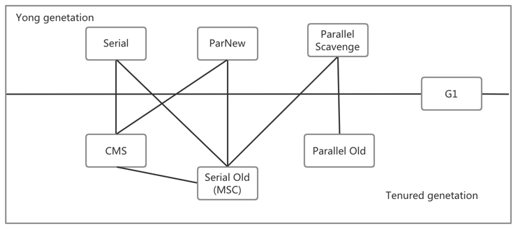
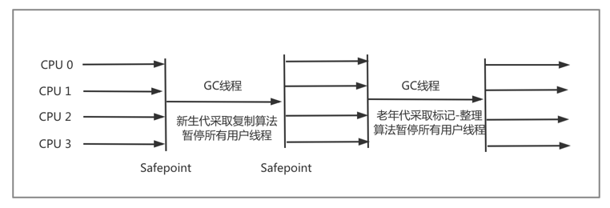
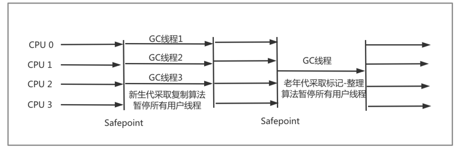
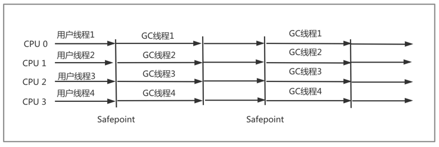
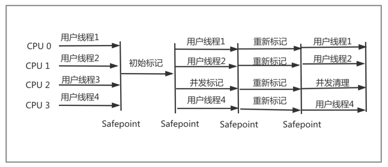
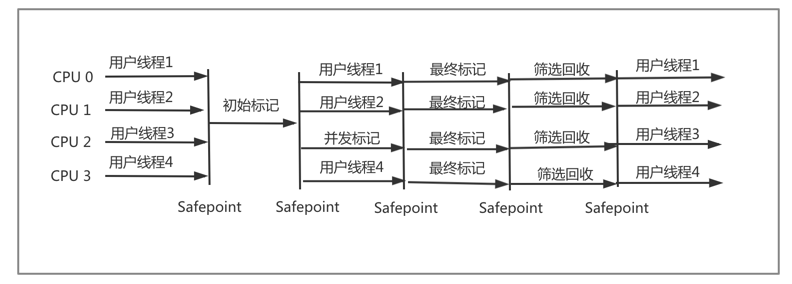

# 垃圾收集器与内存分配策略

## 概述
垃圾收集（GC）早在Java语言诞生之前就已经存在。在垃圾收集诞生之初便考虑到

- 那些内存需要回收

- 什么时候回收

- 如何回收

在如今垃圾回收技术已经相当成熟，我们研究GC和内存分配则是为了，排查内存溢出、内存泄露问题，及当垃圾收集成为系统达到更高并发量的瓶颈时，进行
必要的监控和调节

Java内存运行时区域的各个部分中，程序计数器、虚拟机栈、本地方法栈3个区域随着线程而生，随线程而灭，栈中的栈帧随着方法的进入和退出而有条不紊
地执行着出栈和入栈操作。每个栈帧中分配多少内存基本在类结构定下来就已知，因此这几个区域的内存分配和回收都具备确定性，在这几个区域内不需要过多考
虑回收问题，方法结束或线程结束，内存自然就跟着回收了。Java堆和方法区则不同，一个接口中的多个实现类需要的内存可能不一样，一个方法中的多个
分支需要的内存也可能不一样，我们只有在程序处于运行期间时才知道会创建哪些对象，这部分内存的分配和回收都是动态的，垃圾收集器所关注的就是这部分
内存

## 对象是否死亡
几乎Java中所有的对象实例都在堆中，垃圾收集器在对堆进行回收前，首先需要判断对象是否还存活

### 引用计数法
给对象添加一个引用计数器，当有一个地方引用它时，计数器值加1；当引用失效时，计数器值就减1；任何时刻计数器为0的对象就是不可被再使用的对象，这
便是引用计数法的算法

对于引用计数器在很多地方都有使用，但对于Java虚拟机来说却并没有使用此算法来管理内存，因为其很难解决对象之间的循环引用问题

假设对象A的某个属性赋值了对象B，对象B的某个属性赋值了对象A，除此之外，这两个对象再无任何引用，实际上这两个对象都无法再被访问到，但因为他们
相互引用，导致引用计数器都不为0，于是引用计数器算法无法通知GC收集器回收这两个对象

### 可达性分析算法
主流商用程序语言都是通过可达性分析来判断对象是否存活。此算法的逻辑为通过一系列的称为"GC Roots"的对象作为起点，从这些节点开始向下搜索，搜索
所走过的路径称为引用链，当一个对象到GC Roots没有任何引用链相连时，则证明此对象不可用

在Java中，可作为GC Roots的对象包括以下几种

- 虚拟机栈（栈帧中的本地变量表）中引用的对象

- 方法区中类静态属性引用的对象

- 方法区中常量引用的对象

- 本地方法栈JNI引用的对象

### 引用
不伦是引用计数器算法还是可达性分析，判定对象是否存活都与引用有关，在JDK 1.2之前,Java的引用定义描述: 如果refrence类型的数据中存储的数值
代表另一块内存的起始地址,就称这块内存代表着一个引用.但这种描述过于单一.

在1.2之后,Java将引用分为强引用、软引用、弱引用、虚引用4种.这4种引用强度依次逐渐减弱

- 强引用指程序中普遍存在,类似"Object obj = new Object()"这类的引用，只要强引用还在，垃圾收集器永远不会回收掉被引用对象

- 软引用用来描述一些还有用但并非必需的对象。对于软引用关联着的对象，在系统将要发生内存溢出异常之前，将会把这些对象列进回收范围之中进行第二次
回收。如果这次回收还没有足够的内存，才会抛出内存溢出异常。在JDK 1.2之后，提供了SoftReference类实现软引用
  
- 弱引用也是用来描述非必需对象的，但其强度要比软引用更弱，被软引用关联的对象只能生存到下次垃圾收集发生之前。当垃圾收集器工作时，无论当前内存
是否足够，都会回收掉只被弱引用关联的对象。JDK 1.2之后，提供了WeakRefreence类来实现弱引用
  
- 虚引用也称为幽灵引用或幻影引用，他是最弱的一种引用关系。一个对象是否有虚引用的存在，完全不会对其生存时间构成影响，也无法通过虚引用来获取
一个对象实例。为一个对象设置虚引用关联的唯一目的就是能在这个对象被收集器回收时收到一个系统通知。在JDK 1.2之后，提供PhantomReference来实现
虚引用
  
### 对象回收
即使在可达性分析算法中不可达的对象，也不是非死不可，要真正宣告一个对象死亡，至少要经历两次标记过程：如果对象进行可达性分析后发现没有与GC Roots
相连的引用链，将会被第一次标记，并查看此对象是否有必要执行finalize()方法，当对象没有覆盖finalize()方法，或finalize()方法已经被虚拟机调用
过，虚拟机将这两种情况都视为没必要执行

如果这个对象有必要执行finalize()方法,那么这个对象将会放置在一个F-Queue队列中，并在之后由一个虚拟机自动创建的、低优先级的Finalizer线程
去执行finalize(）方法。但虚拟机并不承诺会等待它运行结束，因为如果一个对象在finalize()方法中执行缓慢或发生死循环，将可能导致F-Queue队列
中其他对象永久处于等待，甚至导致整个回收系统奔溃。finalize()方法是对象逃脱回收命运的最后一次机会，稍后GC将对F-Queue中的对象进行第二次小
规模标记，如果对象在finalize()中将自己重新与引用链上的任何一个对象建立关联，则在第二次标记时它将被移除出即将回收的集合。如果对象进过地二次标记
那么基本就真的被回收了

演示项目如下
```
package main.java.org.aim.gc;

public class FinalizeEscapeGC {
    public static FinalizeEscapeGC SAVE_HOOK = null;
    
    public void isAlive(){
        System.out.println("我还活着");
    }

    @Override
    protected void finalize() throws Throwable {
        super.finalize();
        System.out.println("finalize 执行");
        FinalizeEscapeGC.SAVE_HOOK = this;
    }
    
    public static void main(String[] args) throws InterruptedException {
        SAVE_HOOK = new FinalizeEscapeGC();
        
        // 第一成功执行finalize将自己重新关联上引用链
        SAVE_HOOK = null;
        System.gc();
        Thread.sleep(500);
        if(SAVE_HOOK != null){
            SAVE_HOOK.isAlive();
        } else {
            System.out.println("我挂了");
        }
        
        // 第二次未执行finalize
        SAVE_HOOK = null;
        System.gc();
        Thread.sleep(500);
        if(SAVE_HOOK != null){
            SAVE_HOOK.isAlive();
        } else {
            System.out.println("我挂了");
        }
    }
}
```

并不建议在finalize()方法中将对象重新重新关联上引用链，使其继续存活，因为其运行代价高昂，并且不确定，无法保证各个对象顺序。如果要关闭外部
资源也不建议在这里进行，使用try-finally更便捷也更及时

### 回收方法区
Java虚拟机规范中说过可以不要求虚拟机在方法区实现垃圾收集，但这并不意味着方法区中没有垃圾回收。方法区中进行垃圾收集性价比一般比较低，在堆中
尤其是新生代，常规应用进行一次垃圾收集一般可以回收70%～95%的空间，而永久代的垃圾收集效率远低于此

永久代的垃圾收集主要回收两部分内容：废弃常量和无用的类。回收废弃常量与回收Java堆中的对象非常类似。假如一个字符串"abc"已经进入常量池，但
当前系统没有任何一个String对象叫"abc",也就是说没有任何一个String对象引用常量池的"abc"常量，也没有其它地方引用这个字面量，如果这时发生内存
回收，如果必要，这个"abc"常量会被系统清理出常量池。常量池中的其它类（接口）、方法、字段的符号引用也是类似

判断一个常量是否是废弃常量比较简单，但要判断一个类是否是无用类则比较苛刻。类需要同时满足下面3个条件才算是无用类

- 该类的所有实例都已经被回收，即Java堆中不存在该类的任何实例

- 加载该类的ClassLoader已经被回收

- 该类对应的java.lang.Class对象没有任何地方被引用，无法在任何地方通过反射访问该类的方法

虚拟机可以对满足上述3个条件的无用类进行回收,但并不是一定会被回收.是否对类进行回收,HotSpot虚拟机提供了-Xnoclassgc参数进行控制，还可以使用
-verbose:class以及-XX:+TraceClassLoading、-XX:+TraceClassUnLoading查看类加载和卸载的信息，-verbose:class和-XX:+TraceClassLoading
可以在Product版的虚拟机中使用，-XX:+TranceClassUnLoading参数需要FastDebug版本的虚拟机支持

在大量使用反射、动态代理、CGLib等ByteCode框架、动态生成JSP以及OSGi这类频繁自定义ClassLoader的场景都需要虚拟机具备类卸载的功能，以保证
永久代不会溢出

## 垃圾收集算法

### 标记-清除算法
算法分为标记和清除两个阶段：首先标记出所有需要回收的对象，在标记完成后统一回收所有标记对象。之后的收集算法都是基于这种思路对其不足进行改进。
其不足之处有亮点

- 效率较低，标记和清除两个过程的效率都不高

- 空间碎片，标记清除之后会产生大量不连续的内存碎片，空间碎片太多可能导致，分配大对象时，无法找到足够的连续内存而不得不提前触发另一次垃圾收集
动作
  
### 复制算法
复制算法是为了解决效率的问题，它将可用内存按容量划分为大小相等的两块，每次只使用其中一块，当这块内存用完，就将还存活的对象复制到另一个块上面，
然后在把已使用过的内存空间一次清理掉。每次都是对整个半区进行内存回收，内存分配也不用考虑内存碎片等复杂情况，只要移动堆顶指针，按顺序分配内存即可，
实现简单，运行高效。但这种算法每次只能使用原来内存的一半，代价高昂

现在商业虚拟机都采用这种收集算法来回收新生代，在新生代中的对象大部分情况下98%都是朝生夕死，因此无需1 ：1比列划分内存空间，而是将内存分为
一块较大的Eden空间和两块较小的Survivor空间，每次使用Eden空间和其中一块Survivor，当回收时，将Eden空间和Survivor中还存活的对象一次性复制到
另一块Survivor空间上，最后清理掉Eden和用过的Survivor空间。HostSpot虚拟机默认Eden和Survivor的大小比例是8 ：1，也就是新生代中每次可用内存
空间为整个新生代容量的90%，只有10%内存会被浪费。如果遇到存活的对象大于10%，则需要其它内存（老年代）进行分配担保。这些对象将直接通过分配担保
机制进入老年代

### 标记-整理算法
复制收集算法在对象存活率较高时需要进行较多的复制操作，效率将变低。并且如果不想浪费一半的内存空间，需要额外的空间进行分配担保，应对极端情况下
100%对象存活，因此老年代一般不能直接使用这种算法

根据老年代的特点，提出了标记-整理算法，标记过程与标记-清除算法一样，之后将所有存活的对象都向一端移动，然后直接清理掉端边界以外内存

### 分代收集算法
当前商业虚拟机的垃圾收集都采用分代收集算法。根据对象存活周期不同将内存划分为几块。一般把Java堆分为新生代和老年代，根据各个年代的特点选用
最适合的算法。在新生代，每次垃圾收集都有大批对象死去，只有少量存活，选用复制算法。老年代对象存活率高、没有额外空间进行分配担保，则使用
标记-清理或标记-整理算法回收

## HotSpot的算法实现

### 枚举根节点
可达性分析中从GC Roots节点找引用链，可作为GC Roots的节点主要有全局性的引用（常量、静态属性）与执行上下文（栈帧的本地变量表），现在很多应用
仅方法区就有数百兆，如果逐个检查里面的引用，会消耗很多时间

可达性分析对执行时间的敏感还体现在GC停顿，因为这项工作必须在一个能确保一致性的快照中进行，一致性是指在分析期间执行系统中对象引用关系不能再
变化，不然分析结果准确性就无法得到保证，这是导致GC进行时必须停顿所有Java执行线程的一个重要原因

目前主流Java虚拟机使用的都是准确式GC，当执行系统停顿下来后，并不需要一个不漏的检查完所有执行上下文和全局引用位置，虚拟机知道那些地方存在
对象引用。在HotSpot实现中，使用一组OopMap的数据结构来达到这个目的，在类加载完成时，HotSpot把对象内什么偏移量是什么类型的数据计算出来，在
JIT编译过程中，也会在特定的位置记录下栈和寄存器中那些位置是引用

### 安全点
在OopMap协助下，HotSpot可以快速且准确完成GC Roots枚举，但导致引用关系变化的指令有很多，如果每条指令都生成对应的OopMap，将需要大量的额外空间，
这样GC的空间成本将变得很高

HotSpot没有为每条指令都指定生成OopMap，只在特定位置记录了这些信息，这些位置称为安全点（Safepoint），程序执行时并非在所有地方都停顿下来开始GC，只有到达
安全点时才能暂停。Safepoint的选定既不能太少以至于GC等待时间太长，也不能过于频繁以至于过分增大运行时的负荷。安全点的选定基本上是以程序是否
具有让程序长时间执行的特征为表征选定，因为每条指令执行的时间都非常短暂，程序不太可能因为指令流长度太长而过长时间运行，长时间执行的最显著特征就是
指令序列复用，如方法调用、循环跳转、异常跳转等，所以具有这些功能的指令才会产生Safepoint

为了GC时所有线程都到达最近的安全点上停顿下来，有两种方案可供选择

- 抢先式中断

- 主动式中断

#### 抢先式中断
不需要线程执行代码主动配合，在GC发生时，首先把所有线程全部中断，如果发现有线程中断地方不再安全点上，则恢复线程，让其运行到安全点，目前几乎
没有虚拟机实现采用抢先式中断来暂停线程从而响应GC事件

#### 主动式中断
当GC需要中断线程时，不直接对线程操作，仅简单设置一个标志，各个线程执行时主动去轮询这个标志，发现中断标志为真时就自己中断挂起。轮询标志的地方
和安全点是重合的，另外再加上创建对象需要分配内存的地方

### 安全区域
Safepoint似乎完美解决来如何进入GC的问题，但对于不执行即没有分配CPU时间的程序，例如线程处于Sleep状态或Blocked状态，线程将无法响应JVM中断
请求，JVM也不太可能等待线程重新分配CPU时间，在这种情况先就需要安全区域来解决

安全区域是指在一段代码中，引用关系不会发生变化。在这个区域任何地方开始GC都是安全的。在线程执行到安全区域（Safe Region）中的代码时，首先
标识自己已经进入Safe Region，当在这段时间JVM发起GC时，就不用管标识自己为Safe Region状态的线程，在线程要离开Safe Region时，要检查系统
是否已经完成根节点枚举或整个GC过程，如果完成，那线程就继续执行，否则要等到可以安全离开SafeRegion的信号为止

## 垃圾收集器
Java虚拟机规范中对垃圾收集器应该如何实现并没有任何规定，不同厂商、不同版本的虚拟机提供的垃圾收集器都会有很大差别，并且一般都会提供参数供用户
根据自己的应用特定和要求组合出各个年代所使用的收集器。JDK 1.7 Update 14之后的HotSpot虚拟机包含的收集器如下


7种作用于不同分代的收集器，两个收集器之间的连线，表示可以搭配使用。虚拟机所处的区域，则表示是属于新生代收集器还是老年代收集器

### Serial收集器
Serial收集器是最基本、发展历史最久的收集器，曾是新生代收集的唯一选择。这个收集器是单线程的收集器，并且其在进行垃圾收集时，必须暂停其他所有
工作线程，直到其收集结束。由于这项工作是由虚拟机在后台自动发起和自动完成，用户不可见情况下停止用户正常工作的线程，对用户是难以接受的


虽然Serial被描述成一个老儿无用的收集器，但在Client模式下依然是默认的新生代收集器。Serial收集器也有其优势：简单而高效，在单个CPU环境下，
Serial收集器没有线程交互开销，专职于垃圾收集可以获得最高的单线程收集效率。在用户桌面应用场景中，分配给虚拟机管理的内存不会很大，收集几十
兆甚至一两百兆的新生代，停顿时间完全可以控制在几十毫秒最多一百多毫秒内，只要不频繁发生，这点停顿完全可以接受，在Client模式下Serial收集器
是一个不错的选择。用户可以使用XX:+UseSerialGC强制设置使用Serial收集器，新生代使用Serial，老年代将使用Serial Old

### ParNew收集器
ParNew收集器是Serial收集器的多线程版本，除使用多条线程进行垃圾收集外，其余行为包括Serial收集器可用控制参数、收集算法、Stop The World、
对象分配规则、回收策略等都与Serial收集器完全一样，在实现上，这两种收集器也共用了相当多的代码


ParNew收集器除多线程外，其他与Serial收集器没有太多创新之处，但其却是许多运行在Server模式下的虚拟机中首选的新生代收集器，其中一个与性能无关
的重要原因是，除Serial收集器外，目前他是能与CMS收集器配合工作唯一收集器。在JDK1.5，HotSpot推出一款强交互应用中具有划时代意义的垃圾收集器，
CMS收集器（Concurrent Mark Sweep），这款收集器是HotSpot虚拟机中第一款真正意义上的并发收集器，实现让垃圾收集线程与用户线程基本上同时工作

CMS作为老年代收集器，却无法与JDK1.4.0已经存在的新生代收集器Parallel Scavenge配合工作，因此在JDK1.5中使用CMS收集老年代时，新生代只能
选择ParNew或Serial收集器中的一个，ParNew收集器也是使用-XX:+UseConcMarkSweepGC选项后默认新生代收集器，也可以使用-XX:+UseParNewGC选项
强制指定

ParNew收集器默认开启与CPU数相同的收集线程，在CPU非常多的情况下，可以使用-XX:ParallelGCThreads参数来限制垃圾收集的线程数

### Parallel Scavenge收集器
Parallel Scavenge收集器是一个新生代收集器，使用复制算法，并行的多线程收集器。Parallel Scavenge收集器关注点不同与其他收集器，其关注吞吐量
而非停顿时间。吞吐量指CPU用于运行用户代码的时间与CPU总消耗时间的比值，即吞吐量 = 运行用户代码时间 / (运行用户代码时间 + 垃圾收集时间)

停顿时间越短就越适合需要与用户交互的程序，而高吞吐量则可以高效利用CPU时间，尽快完成程序运算任务，主要适合在后台运算不需要太多交互的任务

Parallel Scavenge收集器提供两个参数用于精确控制吞吐量，分别是控制最大垃圾收集停顿时间的-XX:MaxGCPauseMillis以及直接设置吞吐量的-XX:GCTimeRatio
参数

MaxGCPauseMillis参数允许设置一个大于0的毫秒数，收集器将尽可能保证内存回收花费的时间不超过设定值，但并不是把这个参数值调的越小，系统的垃圾回收
就会变快，GC停顿时间缩短是以牺牲吞吐量和新生代空间换取。系统把新生代调小，收集300MB新生代肯定比收集500MB快，这也直接导致垃圾收集发生更频繁，
停顿时间在下降，但吞吐量也下降了

GCTimeRation参数值为应用程序运行时间与GC时间比值，例如把参数值设置为19，那允许的最大GC时间占总时间的5%（即1 / （1+19）），默认值为99，
即允许最大1%的垃圾收集时间

Parallel Scavenge收集器还有一个参数-XX:+UseAdaptiveSizePolicy需要关注，如果开启这个参数，就不需要手工指定新生代的大小(-Xm)、Eden与Survivor区的比列
（-XX:SurvivorRatio）、晋升老年代对象大小(-XX:PretenureSizeThreshold)等细节参数，虚拟机会根据当前系统的运行情况收集性能监控信息，动态
调整这些参数以提供最合适的停顿时间或最大的吞吐量，这种调节方式称为GC自适应的调节策略。如果用户对收集器运作原理不太了解，手工优化存在困难时，
使用Parallel Scavenge收集器配合自适应调节策略，把内存管理的调节任务交给虚拟机完成是一个不错的选择。只需把基本的内存数据设置好，如-Xmx设置
最大堆，然后通过MaxGCPauseMillis参数或GCTimeRatio给虚拟机设立一个优化目标，具体细节参数的调整工作由虚拟机完成。自适应调节策略也是Parallel Scavenge
收集器与ParNew收集器的重要区别

### Serial Old收集器
Serial Old是Serial收集器的老年代版本，同样是一个单线程收集器，使用"标记-整理"算法。此收集器主要意义是给Client模式下的虚拟机使用，如果在
Server模式下，那主要有两大用途：一种是在JDK 1.5以及之前版本中与Parallel Scavenge收集器搭配使用，另一种用途是作为CMS收集器的后备预案，
在并发收集发生Concurrent Mode Failure时使用。Serial Old收集器工作过程如下


### Parallel Old收集器
Parallel Old是Parallel Scavenge收集器的老年代版本，使用多线程和"标记-整理"算法。此收集器在JDK 1.6中才开始提供，在此之前，新生代选择Parallel Scavenge
收集器，老年代收集器只能选择Serial Old。由于老年代Serial Old收集器在服务端应用性能上的拖累，使用Parallel Scavenge收集器未必能整体上获得
吞吐量最大化的效果，由于单线程老年代收集无法充分利用服务器多CPU处理能力，在老年代很大而且硬件比较高级的环境中，这种组合的吞吐量甚至还不一定有
ParNew加CMS的组合表现更好

直到Parallel Old收集器出现后，"吞吐量优先"收集器才有了真正与其适配的老年代收集器，在注重吞吐量以及CPU资源敏感的场合，可以考虑使用Parallel Scavenge
加Parallel Old收集器



### CMS收集器
CMS收集器是一种以获取最短回收停顿时间为目标的收集器。目前大部分Java应用集中在互联网站或者B/S系统的服务端上，这类应用尤其重视服务的响应速度，
希望系统停顿时间最短，给用户带来更好的体验。CMS收集器非常适合这类应用的需求

CMS收集器是基于"标记-清除"算法实现，它的运作过程相对于前面几种收集器来说更加复杂，分为四个步骤，包括

- 初始标记

- 并发标记

- 重新标记

- 并发清除

初始标记、重新标记这两个步骤仍然需要"Stop The World"。初始标记仅仅只标记一下GC Roots能直接关联的对象，速度很快，并发标记阶段进行GC Roots
Tracing的过程，重新标记阶段则是为修正并发标记期间因用户程序继续运作而导致标记产生变动的那一部分对象的标记记录，这个阶段的停顿时间会比期初
标记阶段稍长一些，但远低于并发标记的时间

由于整个过程中消耗最长的并发标记和并发清除过程收集器都可以与用户线程一起工作。所以总体来看CMS收集器的内存回收过程是与用户线程一起并发执行。



CMS是一款优秀的收集器，它的有点在于：并发收集、低停顿，但是CMS远达不到完美的程度，其主要缺点如下：

- CMS收集器对CPU资源非常敏感，在并发阶段，虽然不会导致用户线程停顿，但是会因为占用一部分CPU资源而导致应用程序变慢，总吞吐量降低。CMS默认
启动的回收线程数是（CPU数量+3）/4，也就是当CPU在4个以上时，并发回收时垃圾收集线程不少于25%的CPU资源，并且随着CPU数量的增加而下降。但当
CPU不足4个时，CMS对用户程序的影响可能会很大，如果本来CPU负载就比较大，还分出一半的运算能力去执行收集器线程，就可能导致用户程序的执行速度
忽然降低了50%。为应付这种情况，虚拟机提供了一种称为"增量式并发收集器"的CMS收集器变种。所做的事情和单CPU年代PC机操作系统使用抢占式来模拟
多任务机制的思想一样，就是在并发标记、清理的时候让GC线程、用户线程交替运行，尽量减少GC线程独占资源的时间，虽然整个垃圾回收的过程会变长，但
对用户程序的影响会显得少些，也就是速度下降没有那么明显。实际使用表明增量式的CMS收集器效果很一般
  
- CMS收集器无法处理浮动垃圾，可能出现"Concurrent Mode Failure"失败而导致另一次Full GC的产生。由于CMS并发清理阶段用户线程还在运行着。伴随
程序运行自然就还会有新的垃圾不断产生，这一部分垃圾出现在标记过程之后，CMS无法在当次收集中处理掉它们，只能留到下一次GC时再清理。这一部分垃圾
称为"浮动垃圾"。由于垃圾收集阶段用户线程还需要运行，需要预留足够的内存空间给用户线程使用，因此CMS收集器不能像其他收集器那样等到老年代几乎被 
填满再进行收集，需要预留一部分空间提供并发收集时的程序运作使用。JDK 1.5默认设置下，CMS收集器当老年代使用68%的空间后就会被激活，这是一个
保守的设置，如果在应用中老年代增长不是太快，可以适当调高参数-XX:CMSInitiatingOccupancyFraction值来提高触发百分比，以便降低内存回收次数
从而获取更好的性能，在JDK 1.6，CMS收集器的启动阈值已经提升至92%。如果CMS运行期间预留的内存无法满足程序需要，就会出现"Concurrent Mode Failure"
失败，这时虚拟机将启动后备预案：临时启用Serial Old收集器来重新进行老年代的垃圾收集，这样停顿时间会很长。参数-XX:CMSInitiatingOccupancyFraction
设置的太高容易导致大量"Concurrent Mode Failure"失败，性能反而降低
  
- CMS采用"标记-清除"算法实现的收集器，因此会导致收集结束后产生大量空间碎片。空间碎片过多，将会给大对象分配带来很大麻烦，往往会出现老年代
还有大量空间剩余，但无法找到足够大的连续空间来分配当前对象，不得不触发一次Full GC。CMS收集器提供了一个-XX:+UseCMSCompactAtFullCollection
开关参数，默认开启，用于在CMS收集器无法满足需求要进行FullGC时开启内存碎片的合并整理过程，内存整理的过程是无法并发，空间碎片解决的同时停顿时间
不得不变长。虚拟机设计者还提供了另外一个参数-XX:CMSFullGCsBeforeCompaction,这个参数是用于设置执行多少次不压缩的Full GC后，跟着一次带压缩 
的Full GC,默认为0，表示每次进入Full GC时都进行碎片整理
  
### G1收集器
G1收集器在JDK 1.7引入。是一款面向服务端应用的垃圾收集器。其使命是替换CMS收集器。与其他GC收集器相比，G1具备如下特点

- 并行与并发：G1充分利用多CPU、多核环境下的硬件优势，使用多个CPU来缩短Stop-The-World停顿时间，部分其他收集器原本需要停顿Java线程执行的
GC动作，G1收集器仍然可以通过并发方式让Java程序继续执行
  
- 分代收集：与其他收集器一样，分代概念在G1中依然得以保留。虽然G1可以不需要其他收集器配合就能独立管理整个GC堆，但它能采用不同方式去处理新
创建的对象和已经存活一段时间、熬过多次GC的旧对象以获取更好的收集效果
  
- 空间整合：与CMS使用标记-清理算法不同，G1从整体看是基于标记-整理算法实现的收集器，从局部看是基于复制算法实现。这意味着G1运作期间不会产生
内存空间碎片，收集后能提供规整的可用内存。这种特性有利于程序长时间运行，分配大对象时无法找到连续内存空间而提前触发GC
  
- 可预测的停顿：G1收集器相对于CMS的另一优势，除共同追求的低停顿外，还能建立可预测的停顿时间模型，能让使用者明确在一个长度为M毫秒的时间片段内，
消耗在垃圾收集上的时间不超过N毫秒
  
在G1收集器之前的其他收集器都是对整个新生代或老年代进行回收，而G1收集器则不同，在使用G1收集器时，虽然还保留新生代和老年代的概念，但Java堆
的内存布局是不同于其他收集器的，它将整个Java堆划分为多个大小相等的独立区域，而新生代和老年代不再物理隔离，它们都是一部分Region的集合

G1收集器能建立可预测停顿时间模型，是因为可以有计划的避免在整个Java堆中进行全区域的垃圾收集。G1跟踪各个Region里面的垃圾堆积的价值大小（回收
所获得的空间大小以及回收所需时间的经验值），在后台维护一个优先列表，每次根据运行的收集时间，优先回收价值最大的Region。这种使用Region划分
内存空间以及有优先级的区域回收方式，保证G1收集器在有限的时间内可以获取尽可能高的效率

G1把内存"化整为零"的思路虽然容易理解，但实现细节却没有想象中那么简单，从Sun发布第一篇G1论文到真正走向商业应用花费了十年时间。在Java将堆
分成多个Region后，但垃圾收集并非就能按Region为单位进行回收。因为Region不可能独立，一个对象分配在某个Region中，并非只能被本Region中其他
对象引用，而是可以与整个Java堆中任意对象发生引用关系。在做可达性分析时就需要扫描整个Java堆才能保证准确性，这个问题并非G1中才有，只是G1更加
突出，在之前的分代收集器中，新生代的规模一般都比老年代要小许多，新生代的收集器也比老年代要频繁许多，回收新生代中的对象时也会面对需要扫描
老年代的问题，导致Minor GC的效率可能下降不少

在G1收集器中，Region之间的对象引用以及其他收集器中新生代与老年代之间的对象引用，虚拟机都是使用Remembered Set来避免全堆扫描。G1中每个Region
都有一个与之对应的Remembered Set，虚拟机发现程序在对Reference类型的数据进行写操作时，会产生一个Write Barrier暂时中断写操作，检查Reference
类型的数据是否处于不同的Region之中，如果是则通过CardTable把相关引用信息记录到被引用对象所属的Region的Remembered Set之中。当进行内存回收时，
在GC根节点的枚举范围中加入Remembered Set即可保证不对全堆扫描也不会遗漏

如果不计算维护Remembered Set操作，G1收集器的运作大致可划分为以下几步：

- 初始标记

- 并发标记

- 最终标记

- 筛选回收

G1的前几个步骤的运作过程和CMS的很多相似之处，初始标记阶段仅仅标记一下GC Roots能直接关联的对象，并修改TAMS的值，让下一阶段用户程序并发运行时，
能在正确可用的Region中创建新对象，这阶段需要停顿线程，但耗时极短。并发标记是从GC Root开始对堆中对象进行可达性分析，找出存活对象，这阶段耗时
较长，但可与用户程序并发执行。最终标记阶段则是为修正在并发标记期间因用户程序继续执行而导致标记产生变动的那一部分标记记录，虚拟机将这段时间对象
的变化记录在线程Remembered Set Logs里面，最终标记阶段需要将Remembered Set Logs的数据合并到Remembered Set中，这阶段需要停顿线程，但可并发
执行。最后筛选回收阶段首先对各个Region的回收价值和成本进行排序，根据用户期望的GC停顿时间制定回收计划。这个阶段其实可以做到与用户程序一起并发执行，
但因为只回收一部分Region，时间是用户可控制，并且停顿用户线程将大幅度提高收集效率


### 理解GC日志
每一种收集器的日志形式都是由他们自身的实现决定，每个收集器的日志格式都可以不一样。但虚拟机设计者为方便用户阅读，将各个收集器的日志都维持一定
的共性，如下例两端GC日志
```
33.125: [GC [DefNew: 3324k->152k(3712k), 0.0025925 secs] 3324k->152k(11904k), 0.0031680 secs]

100.667: [Full GC [Tenured: 0k->210k(10240k), 0.0149142 secs] 4603->210k(19456k), [Perm: 2999k->2999k(21248k)], 0.
0150007 secs] [Times: user=0.01 sys=0.00, real=0.02 secs]
```

- 最前面数字"33.125:" 和 "100.667:"代表GC发生的时间，其含义是从Java虚拟机启动以来经过的毫秒数

- GC日志开头的"[GC"和"[Full GC"说明这次垃圾收集的停顿类型，如果有"Full"，说明这次GC是发生了Stop-The-World。一般在出现担保失败之类的
问题时，就会导致STW。如果是调用System.gc()方法触发的收集，将显示"[Full GC (System)"
  
- "[DefNew"、"[Tenured"、"[Perm"表示GC发生区域，这里显示的区域名称和使用的GC收集器密切相关。例在Serial收集器中新生代名称为"Default New Generation",
所以显示的是"[DefNew"。如果是ParNew收集器，新生代名称为"[ParNew",意为"Parallel New Generation"。如果采用Parallel Scavenge收集器，
其新生代名称为"PSYoungGen"，老年代和永久代同理，名称也是由收集器决定
  
- 方括号内部"3324k->152k(3712k)"含义是"GC前该内存区域已使用容量->GC后该内存区域已使用容量（该内存区域总容量）"。在方括号之外"3324k->152k(11904k)"
表示"GC前Java堆已使用容量->GC后Java堆已使用容量（Java堆总容量）"
  
- 之后"0.0025925 secs"表示该区域GC所占用的时间，单位是秒。有的收集器会给出更具体的时间数据，如"[Times: user=0.01 sys=0.00, real=0.0.2 secs]",
这里的user、sys和real与Linux的time命令所输出的时间含义一致，分别代表用户态消耗的CPU时间、内核态消耗的CPU时间和操作从开始到结束所经历过的墙钟
时间，CPU时间与墙钟时间的区别是，墙钟时间包括各种非运算的等待耗时，例如等待磁盘I/O、等待线程阻塞，而CPU时间不包括这些耗时，当系统有多CPU
或者多核，多线程操作会叠加这些CPU时间
  
### 垃圾收集器参数总结
垃圾收集器相关常用参数如下

参数名     | 参数含义
-------- | -----  
UseSerialGC | 虚拟机运行在Client模式下的默认值，打开此开关后，使用Serial+Serial Old的收集器组合进行内存回收
UserParNewGC  | 打开此开关后，使用ParNew+Serial Old的收集器组合进行内存回收
UseConcMarkSweepGC  | 打开此开关，使用ParNew+CMS+Serial Old的收集器组合进行内存回收。Serial Old收集器将作为CMS收集器出现Concurrent Mode Failure失败后的后备收集器使用
UseParallelGC | 虚拟机运行在Server模式下的默认值，打开此开关后，使用Parallel Scavenge + Serial Old的收集器组合进行内存回收
UseParallelOldGC  | 打开此开关，使用Parallel Scavenge + Parallel Old的收集器组合进行内存回收
SurvivorRatio  | 新生代中Eden区域与Survivor区域的容量比值，默认为8，代表Eden:Survivor=8:1
PretenureSizeThreshold  | 直接晋升到老年代的对象大小，设置此参数后，大于这个参数的对象将直接在老年代分配
MaxTenuringThreshold  | 晋升到老年代对象年龄。每个对象在坚持过一次Minor GC后，年龄就加1，当超过这个参数值就进入老年代
UseAdaptiveSizePolicy  | 动态调整Java堆中各个区域的大小以及老年代年龄
HandlePromotionFailure  | 是否允许分配担保失败，即老年代的剩余空间不足以应付新生代的整个Eden和Survivor区所有对象都存活的极端情况
ParallelGCThreads  | 设置并行GC时进行内存回收的线程数
GCTimeRatio  | GC时间占总时间的比率，默认99，即允许1%的GC时间，仅在使用Parallel Scavenge收集器时生效
MaxGCPauseMillis | 设置GC的最大停顿时间，仅使用parallel Scavenge收集器时生效
CMSInitiationOccupancyFraction  | 设置CMS收集器在老年代空间被使用多少后触发垃圾收集。默认值为68%，仅在使用CMS收集器时生效
UseCMSCompactAtFullCollection  | 设置CMS收集器在完成垃圾收集后是否要进行一次内存碎片整理。仅在使用CMS收集器时生效
CMSFullGCsBeforeCompaction  | 设置CMS收集器在进行若干次垃圾收集后再启动一次内存碎片整理。仅在使用CMS收集器时生效

## 内存分配与回收策略
Java技术体系中所提倡的自动内存管理最终可以归结为自动化地解决两个问题：给对象分配内存以及回收分配对象的内存。对象的内存分配，大的方向讲，是在
堆上分配（也可能经过JIT编译后被拆散为标量类型并间接地栈上分配），对象主要分配在新生代的Eden区上，如果启动了本地线程分配缓冲，将按线程优先
在TLAB上分配。在少数情况下也可能直接在老年代分配，取决于使用的垃圾收集器组合、与内存相关的参数设置

下面示例以Client模式运行虚拟机，使用默认收集器组合，即使用Serial/Serial Old收集器的内存分配回收策略

### 对象优先在Eden分配
大多数情况下，对象在新生代Eden区中分配。当Eden区没有足够空间进行分配时，虚拟机将进行一次Minor GC。-XX:+PrintGCDetails参数用于告诉虚拟机
在发生垃圾收集行为时打印内存回收日志，并在进程退出时输出当前的内存区域分配情况。在实际应用中，内存回收日志打印到文件后通过日志工具进行分析

> - 新生代GC（Minor GC）：指发生在新生代的垃圾收集动作，由于对象大多是朝生夕死，所以Minor GC非常频繁，回收速度也比较快
> - 老年代GC（Major GC / Full GC）：指发生在老年代的GC，出现Major GC，经常会伴有至少一次Minor GC，但并非绝对，Parallel Scavenge收集
器有直接进行Major GC的策略选择过程。Major GC的速度一般会比Minor GC慢10倍以上

```
package main.java.org.aim.gc;

public class AllocationMemory {
    private static final int _1MB = 1024 * 1024;

    public static void main(String[] args){
        testAllocation();
    }
    
    public static void testAllocation(){
        byte[] allocation1,  allocation2, allocation3, allocation4;
        allocation1 = new byte[2 * _1MB];
        allocation2 = new byte[2 * _1MB];
        allocation3 = new byte[2 * _1MB];
        allocation4 = new byte[2 * _1MB];
    }
}
```

在testAllocation()方法中，尝试分配3个2MB大小和一个4MB大小的对象，在运行时通过-Xms20M、-Xmx20M、-Xmn10M将java堆大小限制在20MB,不可
扩展，其中10MB分配给新生代，剩下的10MB分配给老年代。-XX:SurvivorRatio=8决定新生代Eden区与一个Survivor区的空间比例为8：1，执行testAllocation()方法
查看日志如下
```
[GC (Allocation Failure) [DefNew: 7721K->375K(9216K), 0.0063492 secs] 7721K->6519K(19456K), 0.0064133 secs] [Times: user=0.00 sys=0.00, real=0.00 secs] 
Heap
 def new generation   total 9216K, used 4637K [0x00000007bec00000, 0x00000007bf600000, 0x00000007bf600000)
  eden space 8192K,  52% used [0x00000007bec00000, 0x00000007bf029828, 0x00000007bf400000)
  from space 1024K,  36% used [0x00000007bf500000, 0x00000007bf55dc38, 0x00000007bf600000)
  to   space 1024K,   0% used [0x00000007bf400000, 0x00000007bf400000, 0x00000007bf500000)
 tenured generation   total 10240K, used 6144K [0x00000007bf600000, 0x00000007c0000000, 0x00000007c0000000)
   the space 10240K,  60% used [0x00000007bf600000, 0x00000007bfc00030, 0x00000007bfc00200, 0x00000007c0000000)
 Metaspace       used 3056K, capacity 4496K, committed 4864K, reserved 1056768K
  class space    used 334K, capacity 388K, committed 512K, reserved 1048576K
```

其中PSYoungGen      total 9216K, eden space 8192K, from space 1024K, to   space 1024K,表示新生代总可用空间为9126K，eden区为
8192K, 两个Survivor分别为1024K。在分配allocation4对象的语句时会发生一次Minor GC，这次GC结果是新生代7721K变为375K，总内存占用量没有减少，
因为并没有可回收的对象。这次GC是因为给allocation4分配内存时，发现Eden已经被占用6MB，剩余空间已不足以分配allocation4所需的4MB内存，引发
Minor GC，GC期间虚拟机发现已有的3个2MB大小的对象全部无法放入Survivor空间，只能通过分配担保机制提前转移到老年代

GC结束后，4MB的allocation4对象被分配到Eden区中，Survivor空闲，老年代被占用6MB

### 大对象直接进入老年代
大对象是指，需要大量连续内存空间的Java对象，最典型的大对象就是很长的字符串及数组。大对象对虚拟机内存分配来说是一个坏消息，尤其是朝生夕死
的大对象，写程序时应当避免。经常出现大对象容易导致内存还有不少空间时就提前触发垃圾收集以获取足够的连续空间来存放大对象

虚拟机提供一个-XX:PretenureSizeThreshold参数，令大于这个设置的对象直接在老年代分配，避免在Eden区及Survivor区之间发生大量内存负责
```
package main.java.org.aim.gc;

public class PretenureSizeThreshold {

    private static final int _1MB = 1024 * 1024;

    /**
     * VM参数：-verbose:gc -Xms20M -Xmx20M -Xmn10M -XX:+PrintGCDetails -XX:SurvivorRatio=8 
     * -XX:PretenureSizeThreshold=3145728
     * @param args
     */
    public static void main(String[] args){
        testPretenureSizeThreshold();
    }
    
    private static void testPretenureSizeThreshold(){
        byte[] allocation;
        allocation = new byte[4 * _1MB];
    }
}

执行结果
Heap
 def new generation   total 9216K, used 1553K [0x00000007bec00000, 0x00000007bf600000, 0x00000007bf600000)
  eden space 8192K,  18% used [0x00000007bec00000, 0x00000007bed847f8, 0x00000007bf400000)
  from space 1024K,   0% used [0x00000007bf400000, 0x00000007bf400000, 0x00000007bf500000)
  to   space 1024K,   0% used [0x00000007bf500000, 0x00000007bf500000, 0x00000007bf600000)
 tenured generation   total 10240K, used 4096K [0x00000007bf600000, 0x00000007c0000000, 0x00000007c0000000)
   the space 10240K,  40% used [0x00000007bf600000, 0x00000007bfa00010, 0x00000007bfa00200, 0x00000007c0000000)
 Metaspace       used 2963K, capacity 4496K, committed 4864K, reserved 1056768K
  class space    used 328K, capacity 388K, committed 512K, reserved 1048576K
```

执行后可以看到Eden空间几乎没有使用，老年代的10M空间被使用40%，也就是4MB的allocation对象被直接分配到老年代，这是因为PretenureSizeThreshold
被设置为3MB，因此超过3MB的对象会直接在老年代进行分配

> PretenureSizeThreshold参数只能对Serial和ParNew两款收集器有效

### 长期存活的对象将进入老年代
虚拟机采用分代收集思想管理内存，内存回收时必须能够识别哪些对象应放在新生代，哪些对象应放在老年代。虚拟机为每个对象定义一个对象年龄计数器。
如果对象在Eden出生并经过第一次Minor GC后仍然存活，并且能被Survivor容纳，将被移动到Survivor空间中，并且对象年龄设为1。对象在Survivor区
中每经过一次Minor GC，年龄加1，当年龄增加到一定程度，默认为15，将会被晋升到老年代，对象晋升老年代的年龄阈值，可通过参数-XX:MaxTenuringThreshold设置

分别设置-XX:MaxTenuringThreshold=1和-XX:MaxTenuringThreshold=15两种设置来执行如下testTenuringThreshold()方法，此方法中allocation1
对象需要256KB内存，Survivor空间可以容纳。当MaxTenuringThreshold=1时，allocation1对象在第二次GC发生时进入老年代，新生代已使用的内存GC
后非常干净地变为0KB，当MaxTenuringThreshold=15时，第二次GC发生后，allocation1对象还留在新生代Survivor空间，此时新生代仍然占用404KB
```
public class TenuringThreshold {
    private static final int _1MB = 1024 * 1024;

    /**
     * VM参数 -verbose:gc -Xms20M -Xmx20M -Xmn10M -XX:+PrintGCDetails -XX:+UseSerialGC -XX:SurvivorRatio=8 -XX:MaxTenuringThreshold=1
     *  -XX:+PrintTenuringDistribution
     *
     */

    @SuppressWarnings("unused")
    public static void main(String[] args){
        testTenuringThreshold();
    }

    public static void testTenuringThreshold(){
        byte[] allocation1, allocation2, allocation3;
        allocation1 = new byte[_1MB / 4];
        // 什么时候进入老年代取决于XX:MaxTenuringThreshold设置
        allocation2 = new byte[4 * _1MB];
        allocation3 = new byte[4 * _1MB];
        allocation3 = null;
        allocation3 = new byte[4 * _1MB];
    }
}

MaxTenuringThreshold=1参数运行结果

[GC (Allocation Failure) [DefNew
Desired survivor size 524288 bytes, new threshold 1 (max 1)
- age   1:     637792 bytes,     637792 total
: 5727K->622K(9216K), 0.0034164 secs] 5727K->4718K(19456K), 0.0034431 secs] [Times: user=0.00 sys=0.00, real=0.01 secs] 
[GC (Allocation Failure) [DefNew
Desired survivor size 524288 bytes, new threshold 1 (max 1)
: 4718K->0K(9216K), 0.0009050 secs] 8814K->4708K(19456K), 0.0009242 secs] [Times: user=0.00 sys=0.00, real=0.00 secs] 
Heap
 def new generation   total 9216K, used 4260K [0x00000007bec00000, 0x00000007bf600000, 0x00000007bf600000)
  eden space 8192K,  52% used [0x00000007bec00000, 0x00000007bf0290f0, 0x00000007bf400000)
  from space 1024K,   0% used [0x00000007bf400000, 0x00000007bf400000, 0x00000007bf500000)
  to   space 1024K,   0% used [0x00000007bf500000, 0x00000007bf500000, 0x00000007bf600000)
 tenured generation   total 10240K, used 4708K [0x00000007bf600000, 0x00000007c0000000, 0x00000007c0000000)
   the space 10240K,  45% used [0x00000007bf600000, 0x00000007bfa990b8, 0x00000007bfa99200, 0x00000007c0000000)
 Metaspace       used 2951K, capacity 4496K, committed 4864K, reserved 1056768K
  class space    used 326K, capacity 388K, committed 512K, reserved 1048576K
  
MaxTenuringThreshold=15参数运行结果

[GC (Allocation Failure) [DefNew
Desired survivor size 524288 bytes, new threshold 1 (max 15)
- age   1:     637560 bytes,     637560 total
: 5727K->622K(9216K), 0.0055470 secs] 5727K->4718K(19456K), 0.0055985 secs] [Times: user=0.00 sys=0.00, real=0.00 secs] 
[GC (Allocation Failure) [DefNew
Desired survivor size 524288 bytes, new threshold 15 (max 15)
- age   1:        232 bytes,        232 total
: 4800K->0K(9216K), 0.0012287 secs] 8896K->4708K(19456K), 0.0012510 secs] [Times: user=0.00 sys=0.00, real=0.00 secs] 
Heap
 def new generation   total 9216K, used 4315K [0x00000007bec00000, 0x00000007bf600000, 0x00000007bf600000)
  eden space 8192K,  52% used [0x00000007bec00000, 0x00000007bf036ce0, 0x00000007bf400000)
  from space 1024K,   0% used [0x00000007bf400000, 0x00000007bf4000e8, 0x00000007bf500000)
  to   space 1024K,   0% used [0x00000007bf500000, 0x00000007bf500000, 0x00000007bf600000)
 tenured generation   total 10240K, used 4707K [0x00000007bf600000, 0x00000007c0000000, 0x00000007c0000000)
   the space 10240K,  45% used [0x00000007bf600000, 0x00000007bfa98fd0, 0x00000007bfa99000, 0x00000007c0000000)
 Metaspace       used 2941K, capacity 4496K, committed 4864K, reserved 1056768K
  class space    used 322K, capacity 388K, committed 512K, reserved 1048576K
```

### 动态对象年龄判断
为更好适应不同程序内存状况，虚拟机并不是永远要求对象的年龄必须达到MaxTenuringThreshold才能晋升老年代，如果在Survivor空间中相同年龄所有
对象大小的总和大于Survivor空间的一半，年龄大于等于该年龄的对象就可以直接进入老年代，无须等到MaxTenuringThreshold中要求的年龄

执行testTenuringThreshold2()方法，并设置-XX:MaxTenuringThreshold=15，发现运行结果中Survivor空间占用仍然为0%，而老年代比预期增加6%，
allocation1、allocation2对象都直接进入老年代，且没有到达15岁的临界年龄。

```
package main.java.org.aim.gc;

public class TenuringThreshold {
    private static final int _1MB = 1024 * 1024;

    /**
     * VM参数 -verbose:gc -Xms20M -Xmx20M -Xmn10M -XX:+PrintGCDetails -XX:+UseSerialGC -XX:SurvivorRatio=8 -XX:MaxTenuringThreshold=15
     *  -XX:+PrintTenuringDistribution
     *
     */

    @SuppressWarnings("unused")
    public static void main(String[] args){
        testTenuringThreshold2();
    }
    
    @SuppressWarnings("unused")
    public static void testTenuringThreshold2(){
        byte[] allocation1, allocation2, allocation3, allocation4;
        allocation1 = new byte[_1MB / 4];

        allocation2 = new byte[_1MB / 4];
        allocation3 = new byte[4 * _1MB];
        allocation4 = new byte[4 * _1MB];

        allocation4 = null;
        allocation4 = new byte[4 * _1MB];
    }
}

执行结果

[GC (Allocation Failure) [DefNew
Desired survivor size 524288 bytes, new threshold 1 (max 15)
- age   1:     900152 bytes,     900152 total
: 5983K->879K(9216K), 0.0038299 secs] 5983K->4975K(19456K), 0.0038552 secs] [Times: user=0.00 sys=0.00, real=0.01 secs] 
[GC (Allocation Failure) [DefNew
Desired survivor size 524288 bytes, new threshold 15 (max 15)
: 4975K->0K(9216K), 0.0012411 secs] 9071K->4964K(19456K), 0.0012631 secs] [Times: user=0.00 sys=0.00, real=0.00 secs] 
Heap
 def new generation   total 9216K, used 4260K [0x00000007bec00000, 0x00000007bf600000, 0x00000007bf600000)
  eden space 8192K,  52% used [0x00000007bec00000, 0x00000007bf0290f0, 0x00000007bf400000)
  from space 1024K,   0% used [0x00000007bf400000, 0x00000007bf400000, 0x00000007bf500000)
  to   space 1024K,   0% used [0x00000007bf500000, 0x00000007bf500000, 0x00000007bf600000)
 tenured generation   total 10240K, used 4964K [0x00000007bf600000, 0x00000007c0000000, 0x00000007c0000000)
   the space 10240K,  48% used [0x00000007bf600000, 0x00000007bfad9190, 0x00000007bfad9200, 0x00000007c0000000)
 Metaspace       used 2947K, capacity 4496K, committed 4864K, reserved 1056768K
  class space    used 323K, capacity 388K, committed 512K, reserved 1048576K
```

### 空间分配担保
发生Minor GC之前，虚拟机先检查老年代最大可用的连续空间是否大于新生代所有对象总空间，条件成立，Minor GC可以确保是安全的。不成立，虚拟机
会查看HandlePromotionFailure设置值是否允许担保失败，允许则会继续查看老年代最大可用连续空间是否大于历次晋升到老年代对象的平均大小，大于则
尝试进行一次Minor GC，尽管这次Minor GC是有风险的。如果小于或HandlerPromotionFailure设置不允许冒险，则会进行一次Full GC

新生代使用复制收集算法，但为了内存利用率，只使用其中一个Survivor空间来作为轮换备份，因此如果出现大量对象在Minor GC后仍然进行分配担保，把
Survivor无法容哪的对象直接进入老年代。老年代要进行这样的担保，前提是老年代还有容纳对象的剩余空间，一共有多少对象能活下来在实际完成内存回收之前
是无法明确知道，只能取每次回收晋升到老年代对象容量的平均值作为经验值，与老年代剩余空间进行比较，决定是否进行Full GC来让老年代腾出更多空间

取平均值比较只是动态概率的手段，如果某次Minor GC存活后的对象突增，远高于平均值，依然会担保失败。如果出现HandlePromotionFailure失败，那
只好在失败后重新发起一次Full GC。虽然担保失败，效率最低，但大部分情况仍然会打开HandlePromotionFailure，避免Full GC过于频繁

在JDK 6 Update 24之后，HandlePromotionFailure参数不会再影响到虚拟机的空间分配担保策略，虽然源码中还定义HandlePromotionFailure参数，
但在代码中已经不会再使用。JDK 6 Update 24之后的规则只要老年代连续空间大于新生代对象总大小或者历次晋升的平均大小就进行Minor GC，否则将进行
Full GC

