# 虚拟机性能监控与故障处理工具

## 概述
给一个系统定位问题时，知识、经验是关键基础，数据是依据，工具是运用知识处理数据的手段。这里的数据包括：运行日志、异常堆栈、GC日志、线程快照、
堆转储快照等。使用适当的虚拟机监控和分析工具可以加快分析数据、定位解决问题的速度

## JDK的命令行工具
在JDK的bin目录中提供了很多命令行工具，这些命令行工具为用户处理应用程序性能问题、定位故障提供了帮助。下面将介绍其中关于监视虚拟机和故障处理
的工具。这些JDK工具都非常小,基本都在27KB左右,大多数都是对jdk/lib/tools.jar类库的一层薄包装。之所以选用Java代码实现这些监控工具，是因为当
程序部署到生产环境后，无论是直接接触物理服务器还是远程Telnet到服务器都可能会受到限制。借助tools.jar类库中的接口，可以直接在应用程序中实现
功能强大的监控分析工具，由于部分功能基于JMX，因此需要开启JMX管理功能，JDK 1.6之上的虚拟机默认开启。JDK主要命令行监控工具用途如下

名称                           | 主要作用    
--------------------------------- | ------------------ 
jps     | JVM Process Status Tool, 显示指定系统内所有的HotSpot虚拟机进程       
jstat   | JVM Statistics Monitoring Tool，用于收集HotSpot虚拟机各方面的运行数据       
jinfo   | Configuration Info for Java, 显示虚拟机配置信息       
jmap    | Memory Map for Java，生成虚拟机内存转储快照（heapdump文件）       
jhat    | JVM Heap Dump Browser，用于分析heapdump文件，其会建立一个HTTP/HTML服务器，让用户可以在浏览器上查看分析结果       
jstack  | Stack Trace for Java,显示虚拟机的线程快照

### jps: 虚拟机进程状况工具
jps可以列出正在运行的虚拟机进程,并显示虚拟机执行主类名称以及这些进程的本地虚拟机唯一ID（Local Virtual Machine Identifier, LVMID）。
虽然功能比较单一，但确是使用频率最高的JDK命令行工具，其他JDK工具大多需要输入它查询到的LVMID来确定要监控的是哪一个虚拟机进程。对本地虚拟机
进程来说，LVMID与操作系统的进程ID是一致的，使用UNIX的ps命令也可以查询到虚拟机进程的LVMID，但如果同时启动多个虚拟机进程，则无法根据虚拟机
进程名称定位，只能依赖jps命令显示主类的功能才能区分

jsp命令格式:

jps [options] [hostid]

jps可以通过RMI协议查询开启RMI服务的远程虚拟机进程状态，hostid为RMI注册表中注册的主机名。jps其他常用选项

选项                           | 作用
--------------------------------- | ------------------ 
-q   | 只输出LVMID，省略主类名称
-m   | 输出虚拟机进程启动时传递给主类main()参数的参数
-l   | 输出主类的全名，如果进程执行的是Jar表，输出Jar路径
-v   | 输出虚拟机进程启动时JVM参数

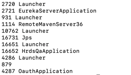

### jstat：虚拟机统计信息监控工具
jstat是用于监控虚拟机各种运行状态信息的命令行工具。可以显示本地或远程虚拟机进程中的类装载、内存、垃圾收集、JIT编译等运行数据，在没有GUI图形
界面，只提供纯文本控制台环境的服务器上，将是运行期定位虚拟机性能问题的首选工具

jstat命令格式：

jstat [option vmid [interval [s|ms] [count]]]

对于命令格式中的VMID与LVMID需要特别说明一下：如果是本地虚拟机进程，VMID与LVMID是一致的，如果是远程虚拟机进程，VMID格式为:
[protocol:][//]lvmid[@hostname[:port]/servername]

参数interval和count代表查询间隔和次数，如果省略这两个参数，说明只查询一次。假设每250毫秒查询一次进程2764垃圾收集状态，一共查询20次，命令为：
jstat -gc 2764 250 20

选项option代表用户希望查询的虚拟机信息，主要分为3类：类装载、垃圾收集、运行期编译状况

选项                           | 作用
--------------------------------- | ------------------ 
-class   | 监视类装载、卸载数量、总空间以及类装载所耗费的时间
-gc   | 监视Java堆状况，包括Eden区、两个survivor区、老年代、永久代等的容量、已用空间、GC时间合计等信息
-gccapacity   | 监视内容与-gc基本相同，但输出主要关注Java堆各个区域使用到的最大、最小空间
-gcutil   | 监视器内容与-gc基本相同，但输出主要关注已使用空间占总空间的百分比
-gccause   | 与-gcutil功能一样，但是会额外输出导致上一次GC产生的原因
-gcnew   | 监视新生代GC状况
-gcnewcapacity   | 监视内容与-gcnew基本相同，输出主要关注使用到的最大、最小空间
-gcold   | 监控老年代GC状况
-gcoldcapacity   | 监控内容与-gcold基本相同，输出主要关注使用到的最大、最小空间
-gcpermcapacity | 输出永久代使用的最大、最小空间
-compiler   | 输出JIT编译器编译过的方法、耗时等信息
-printcompilation   | 输出已经被JIT编译的方法

运行jstat -gcutil 18105,结果如下

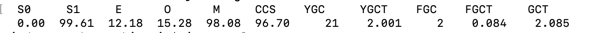

查询结果表示：

- 这台服务器新生代Eden区（E,表示Eden）使用了12.18%的空间
  
- 两个Survivor区，分别是s0，没用使用任何空间；s1，使用99.61%的空间

- 老年代（O，代表old）使用15.28%空间
  
- 元空间（M，表示Metaspace）占用98.08%
  
- CCS表示压缩类空间，使用96.70%

- YGC，新生代GC即Minor GC共发生21次

- YGCT表示21次Minor GC总耗时2.001秒

- FGC表示Full GC两次

- FGCT表示两次Full GC总耗时0.084秒

- GCT表示GC总耗时2.085秒

### jinfo: Java配置信息工具
jinfo可以实时查看和调整虚拟机各项参数。使用jps命令的-v参数可以查看虚拟机启动时显式指定的参数列表，但如果想知道未被显式指定的参数的系统默认值，
则需要使用jinfo 的-flag选项进行查询，也可以使用java -XX:+PrintFlagsFinal查看参数默认值。jinfo还可以使用-sysprops选项把虚拟机进程的
System.getProperties()的内容打印出来。使用-flag [+|-] name或者-flag name=value可修改一部分运行期可写的虚拟机参数值

查询CMSInitiatingOccupancyFraction参数值
```
jinfo -flag CMSInitiatingOccupancyFraction 1444
```

### jmap: java内存映像工具
jmap命令用于生成堆转存储快照，一般称为heapdump或dump文件。如果不使用jmap命令，想要获取Java堆转存储快照，还有一些比较暴力的方式，例如使用
-XX:+HeapDumpOnOutOfMemoryError参数，可以让虚拟机在OOM异常出现之后自动生成dump文件

jmap的作用并不仅仅是为了获取dump文件，还可以查询finalize执行队列、Java堆和永久代的详细信息，如空间使用率、当前用的那种收集器

jmap命令格式：

jmap [option] vmid

option选项的合法值如下

名称                           | 主要作用
--------------------------------- | ------------------ 
-dump | 生成Java堆转储快照，格式为：-dump:[live, ]format=b, file=<filename>,其中live子参数说明是否只dump出存活的对象
-finalizerinfo |  显示在F-Queue中等待Finalizer线程执行finalize方法的对象
-heap | 显示Java堆详细信息，如使用哪种回收器、参数配置、分代情况等，只在Linux有效
-histo | 显示堆中对象统计信息，包括类、实例数量、合计容量
-permstat | 以ClassLoader为统计口径显示永久代内存状态。只在Linux平台下有效
-F | 当虚拟机进程对-dump选项没有响应时，可使用这个选项强制生成dump快照，Linux平台下有效

如下示例使用jmap生成一个正在运行的服务的快照文件，其中16652是通过jps命令查询到的LVMID

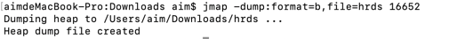

### jhat: 虚拟机堆转存储快照分析工具
jhat命令与jmap搭配使用，分析jmap生成的堆转存储快照。jhat内置一个微型HTTP/HTML服务器，生成dump文件的分析结果后，可以在浏览器中查看。在实际
使用中，通常并不会直接使用jhat命令来分析dump文件，主要原因有

- 一般不会在部署应用程序的服务器上直接分析dump文件，尽量将dump文件复制到其他机器上进行分析，分析是一个耗时而且消耗硬件资源的过程，在其他机器
上进行分析也就没有必要限制使用命令行工具了
  
- jhat分析功能相对简陋。VisualVM，以及专业用于分析dump文件的Eclipse Memory Analyzer、IBM HeapAnalyzer等工具，都实现了更强大专业的分析
功能

显示"Server is ready"提示后，用户在浏览器中输入http://localhost:7000/即可看到分析结果  

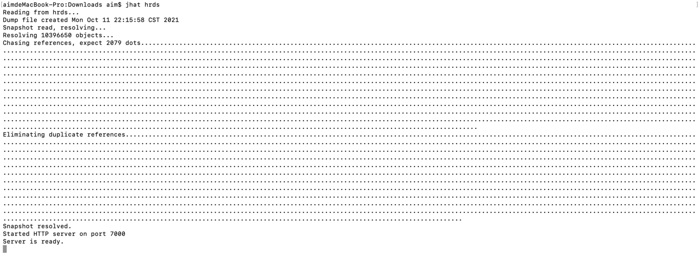

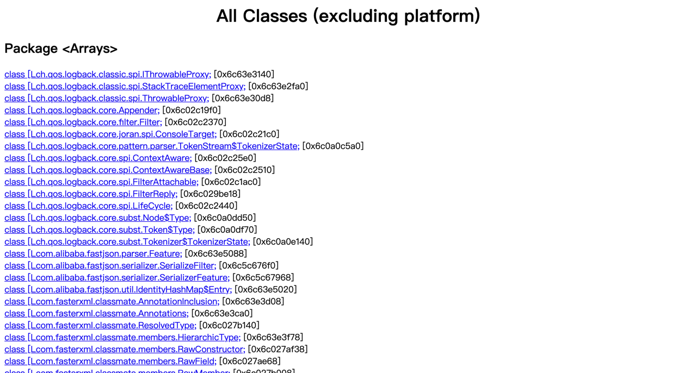

分析结果默认以包为单位进行分组显示，分析内存泄漏问题主要会使用其中的"Heap Histogram"，与jmap -histo功能一样。与OQL叶签功能，前者可以找到
内存中总容量最大的对象，后者是标准的对象查询语言，使用类似SQL的语法对内存中的对象进行查询统计

### jstack: Java堆栈跟踪工具
jstack命令用于生成虚拟机当前时刻的线程快照，一般称为threaddump或者javacore文件。线程快照即当前虚拟机内每一条线程正在执行的方法堆栈的集合，
生成线程快照的主要目的是定位线程出现长时间停顿的常见原因，如线程间锁死、死循环、请求外部资源导致的长时间等待都是导致线程长时间停顿的常见原因。
线程出现停顿时通过jstack来查看各个线程的调用堆栈，可以知道没有响应的线程到底在后台做什么，或等待着什么资源

jstack命令格式:

jstack [option] vmid

option选项的合法值与具体含义表

名称                           | 主要作用
--------------------------------- | ------------------ 
-F | 当正常输出的请求不被响应时，强制输出线程堆栈
-l | 除堆栈外，显示关于锁的附加信息
-m | 如果调用到本地方法，可以显示C/C++的堆栈

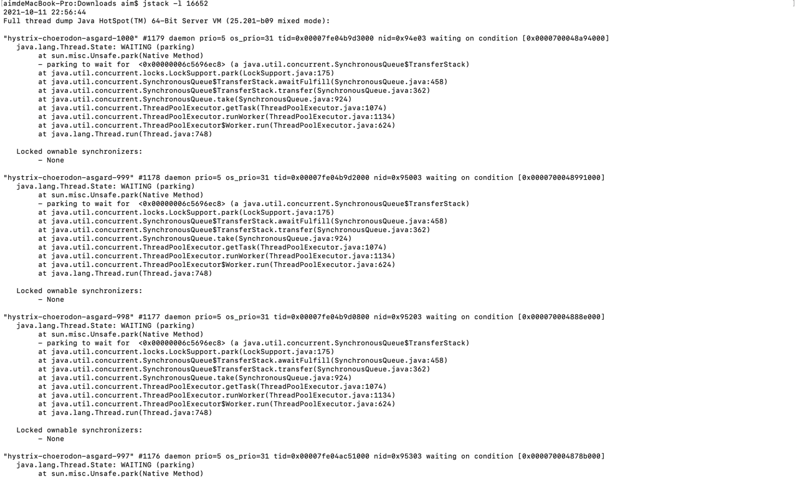

在JDK 1.5中，java.lang.Thread类新增了一个getAllStackTraces()方法用于获取虚拟机中所有线程的StackTraceElement对象。使用这个方法可以
简单的几行代码就完成jstack的大部分功能，实际项目中可以调用此方法实现一个管理员页面，可以随时使用浏览器来查看看出堆栈

### HSDIS：JIT生成代码反汇编
在Java虚拟机规范中，详细描述了虚拟机指令集中每条指令的执行过程、执行前后对操作数栈、局部变量表的影响等细节。这些细节描述与Sun早期虚拟机高度吻合，
但随着技术的发展，高性能虚拟机真正的细节实现方式已经渐渐与虚拟机规范所描述的内容产生越来越大的差距，虚拟机规范中的描述逐渐成了虚拟机实现中的概念模型，
实现只能保证规范描述等效。因此在我们分析程序的执行语义问题时，在字节码层面上分析完全可行，但分析程序的执行行为问题时，在字节码层面分析没有什么意义，
需要通过其他方式解决

分析程序如何执行，通过软件调试工具来断点调试是最常见手段，但这样的调试方式在Java虚拟机中会遇到很大困难，因为大量执行代码是通过JIT编译动态生成到
CodeBuffer中，没有很简单的手段来处理这种混合模式的调试，因此不得不通过一些特别的手段来解决问题，HSDIS插件就是其中之一

HSDIS是一个sun官方推荐的HotSpot虚拟机JIT编译代码的反汇编插件，其包含在HotSpot虚拟机的源码中，没有提供编译后的程序。其作用是让HotSpot的
-XX:+PrintAssembly指令调用它来把动态生成的本地代码还原为汇编代码输出，同时生成大量非常有价值的注释，我们可以通过输出的代码来分析问题。可以
根据自己操作系统和CPU类型从Project Kenai的网站上下载编译好的插件，直接放到JDK_HOME/jre/bin/client和JDK_HOME/jre/bin/server目录中。
如果未找到所需操作系统成品，可以自己使用源码编译

如果使用的是Debug或FastDebug版本的HotSpot，可以直接通过-XX:+PrintAssembly指令使用插件；如果使用Product版本HotSpot，还需要额外加一个
-XX:+UnlockDiagnosticVMOption参数

## JDK可视化工具
JDK中除提供大量的命令行工具外，还有两个功能强大得到可视化工具: JConsole和VisualVM。其中JConsole是在JDK1.5时期就已经提供的虚拟机监控工具，
而VisualVM在JDK1.6 Update7中才首次发布，现在已成为主力推动的多合一故障处理工具，并从JDK中分离出来成为可以独立发展的开源项目

### JConsole：Java监视与管理控制台
JConsole是一种基于JMX的可视化监视、管理工具。其管理部分功能是针对JMX MBean进行管理，由于MBean可以使用代码、中间服务器的管理控制台或所有
符合JMX规范的软件进行访问

#### 启动JConsole
通过JDK/bin目录下的"jconsole.exe"启动JConsole后，将自动搜索出本机运行的所有虚拟机进程，不需要用户使用jps来查询。双击选择其中一个进程即可开始监控，
也可使用远程进程功能来连接远程服务器，对远程虚拟机进行监控

我们选择需要监控对进程后，可以看到主界面共包括"概述"、"内存"、"线程"、"类"、"VM摘要"、"MBean"标签页

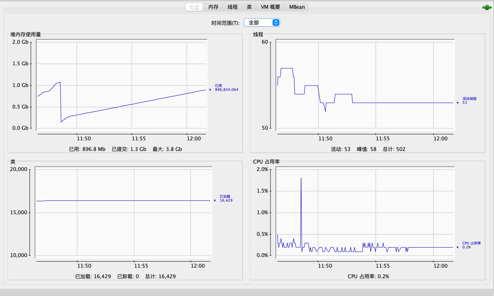

"概述"页签显示整个虚拟机主要运行数据的概览，其中包括"堆内存使用情况"、"线程"、"类"、"CPU使用情况"信息的曲线图，这些曲线是后面"内存"、"线程"、
"类"页签的信息汇总

#### 内存监控
"内存"页签相当于可视化的jstat命令，用于监视受收集器管理的虚拟机内存（Java堆和永久代）的变化趋势。我们先开发一个测试示例程序

```
package main.java.org.aim.oom;

import java.util.ArrayList;
import java.util.List;

/**
 * 测试内存监控示例代码
 */
public class OOMObject {
    public byte[] placeholder = new byte[64 * 1024];

    public static void fillHeap(int num) throws InterruptedException {
        List<OOMObject> list = new ArrayList<OOMObject>();
        for (int i = 0; i < num; i++){
            Thread.sleep(50);
            list.add(new OOMObject());
        }
        System.gc();
    }

    public static void main(String[] args) throws InterruptedException {
        fillHeap(10000);
    }
}
```

设置运行时虚拟机参为：-Xms100m -Xmx100m -XX:+UserSerialGC,运行上述示例，上述代码会以64KB/50毫秒速度往Java堆中填充数据，共填充10000次，
通过"内存"页签查看内存变化

我们可以看到整个堆内存是一条向上的平滑曲线，并且从柱状图可以看出，在所有循环结束，运行System.gc()后，虽然整个新生代Eden和Survivor区基本清空，
但代表老年代的柱状图仍然保持峰值，说名被填充进堆中的数据在System.gc()方法执行后仍然存活。这是因为作用域内对象依然可访问，如果将System.gc()方法执行
放到fillHeap方法外将能正常回收

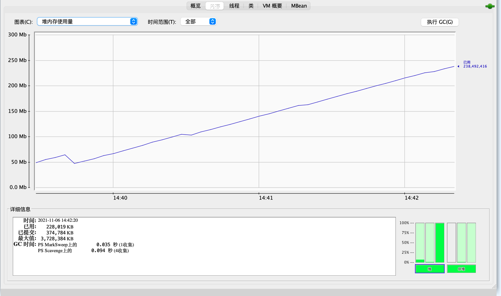

内存池Eden区的运行趋势呈现折线状

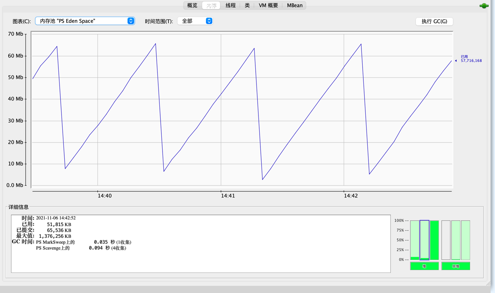

Survivor区呈现上升持平一段时间后下降为零的变化趋势

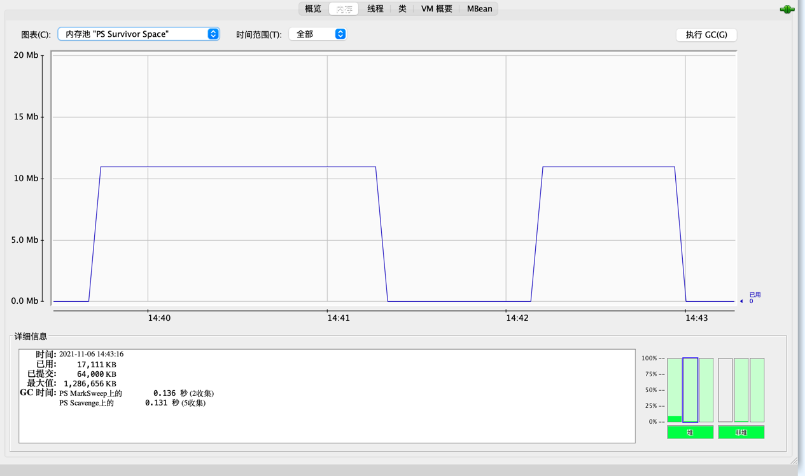

#### 线程监控
"线程"页签功能相当于可视化jstack命令，遇到线程停顿可以使用这个页签进行监控分析。线程长时间停顿主要是由于等待外部资源（数据库连接、网络资源、
设备资源等）、死循环、锁等待（活锁、死锁）。我们先展示一个线程等待的示例

```
package main.java.org.aim.thread;

import java.io.BufferedReader;
import java.io.IOException;
import java.io.InputStreamReader;

/**
 * 线程等待示例
 */
public class WaitThread {

    /**
     * 线程死循环演示
     */
    public static void createBusyThread(){
        Thread thread = new Thread(new Runnable() {
            @Override
            public void run() {
                while(true)
                    ;
            }
        }, "testBusyThread");
        thread.start();
    }

    /**
     * 线程锁等待演示
     * @param lock
     */
    public static void createLockThread(final Object lock){
        Thread thread = new Thread(new Runnable() {
            @Override
            public void run() {
                synchronized (lock){
                    try {
                        lock.wait();
                    } catch (InterruptedException e) {
                        e.printStackTrace();
                    }
                }
            }
        }, "testLockThread");
        thread.start();
    }

    public static void main(String[] args) throws IOException {
        BufferedReader br = new BufferedReader(new InputStreamReader(System.in));
        br.readLine();
        createBusyThread();
        br.readLine();
        Object obj = new Object();
        createLockThread(obj);
    }
}
```

运行上述程序，在"线程"页签中选择main线程，堆栈追踪显示BufferedReader在readBytes方法中等待System.in的键盘输入，此时线程为Runnable状态，
Runnable状态线程会被分配运行时间，但readBytes方法检查到流没有更新时会立刻归还执行令牌，这种等待只会消耗很小的CPU资源

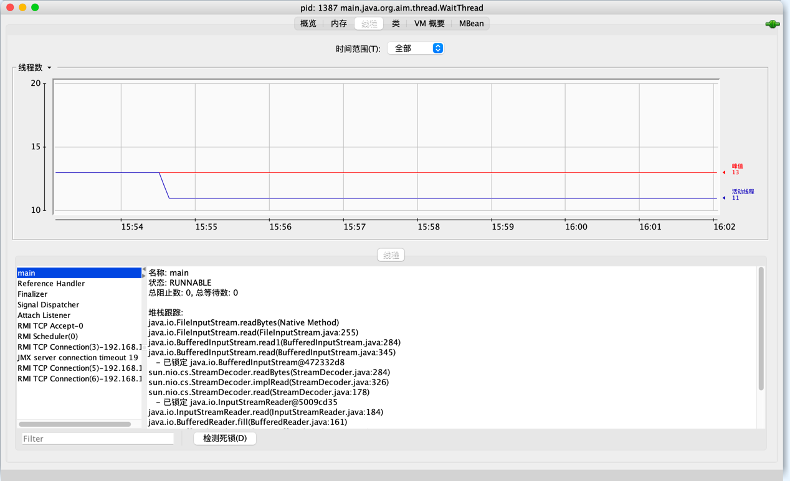

接下来监控testBusyThread线程，testBusyThread线程一直在执行空循环，从堆栈追踪中看到WaitThread.java代码停留在20行，20行为while(true) ;
此时线程为Runnable状态，没有归还线程执行令牌的动作，会在空循环上用尽全部执行时间直到线程切换，这种等待会消耗较多的CPU资源

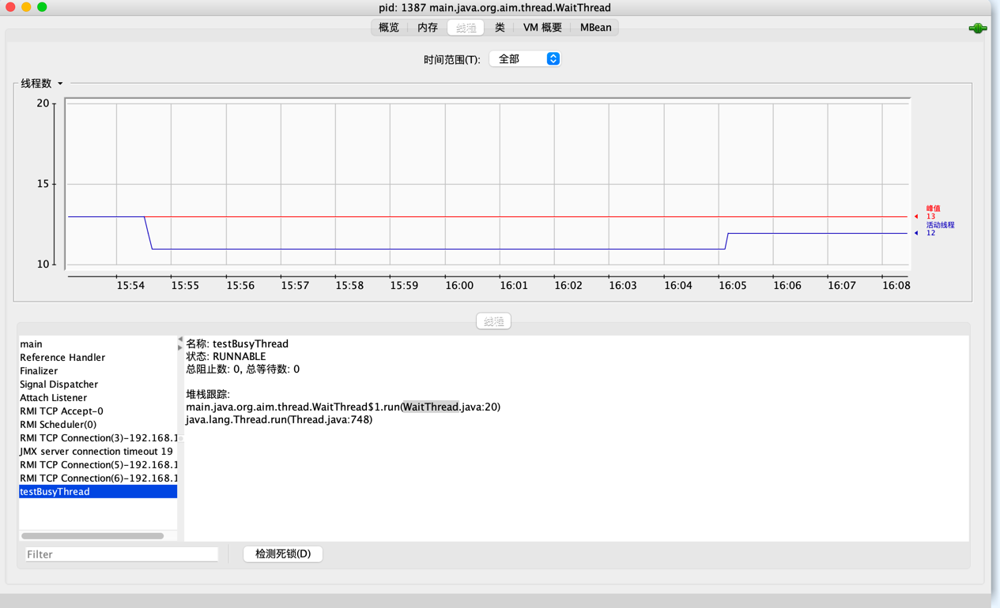

testLockThread线程等待lock对象的notify或notifyAll方法的出现，线程这时候处于WAITING状态，被唤醒前不会分配执行时间，线程处于活锁状态

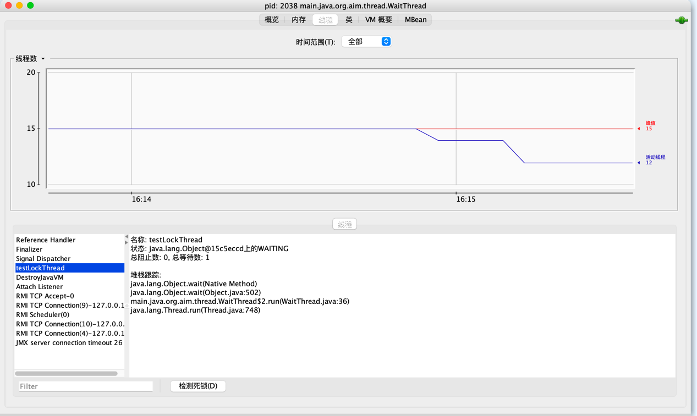

接下来给出一个死锁示例
```
package main.java.org.aim.thread;

/**
 * 线程死锁演示
 */
public class DeadThread {
    static class SynAddRunnable implements Runnable {
        int a, b;

        public SynAddRunnable(int a, int b) {
            this.a = a;
            this.b = b;
        }

        @Override
        public void run() {
            synchronized (Integer.valueOf(a)) {
                synchronized (Integer.valueOf(b)) {
                    System.out.println(a + b);
                }
            }
        }
    }

    public static void main(String[] args) {
        for (int i = 0; i < 100; i++) {
            new Thread(new SynAddRunnable(1, 2)).start();
            new Thread(new SynAddRunnable(2, 1)).start();
        }
    }
}
```

通过循环加大死锁的概率，上述代码可能出现的一种情况是A线程持有Integer.valueOf(1)，尝试获取Integer.valueOf(2)锁，B线程持有Integer.valueOf(2)，
尝试获取Integer.valueOf(1)，这样就导致A、B线程相互等待，出现死锁

出现线程死锁后，点击"检测死锁"按钮，会出现一个新的"死锁"页签
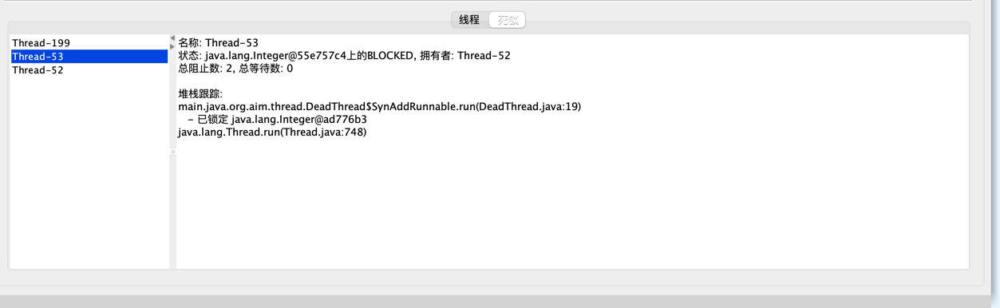

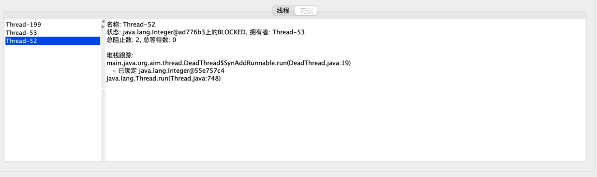

我们可以看到线程Thread-53在等待一个被线程Thread-52持有的Integer对象，线程Thread-52则显示在等待一个Integer对象，被线程Thread-53持有

### VisualVM：多合一故障处理工具
VisualVM是随JDK发布的功能强大的运行监视和故障处理程序，其除了运行监视、故障处理外，还提供了很多其他方面的功能。如性能分析，而且VisualVM还有
一个很大的有点：不需要被监视的程序基于特殊Agent运行，因此对应用程序的实际性能影响很小，使得其可以直接应用在生产环境中

#### VisualVM兼容范围与插件安装
VisualVM基于NetBeans平台开发，通过插件扩展支持，VisualVM可以做到：

- 显示虚拟机进程以及进程的配置、环境信息

- 监视应用程序的CPU、GC、堆、方法区以及线程信息

- dump以及分析堆转存储快照

- 方法级的程序运行性能分析、找出被调用最多、运行时间最长的方法

- 离线程序快照：搜集程序的运行配置、线程dump、内存dump等信息建立一个快照，可以将快照发送开发者进行bug反馈

- 支持插件扩展

直接启动VisualVM不加载任何插件，则只有基本的监视、线程面板的功能，这些基础功能都是以默认插件的形式提供，因此需要使用更丰富强大的功能，我们
需要安装各种功能插件

插件安装即支持手动安装，也支持自动安装。手动安装需要在相关网站下载*.nbm包，点击"工具" -> "插件" -> "已下载"，在弹出对话框中指定nbm包路径
便可安装，插件安装完后存在JDK_HOME/lib/visualvm/visualvm中。自动安装只需要在联网的环境下，点击"工具" -> "插件菜单"，进行安装

#### 生成、浏览堆转存快照
在VisualVM中生成dump文件有两种方式

- 在"应用程序"窗口中右键单击应用程序节点，然后选择"堆Dump"

- 在"应用程序"窗口双击应用程序节点打开应用程序标签，然后在"监视"标签中单击"堆Dump"

生成dump文件后，应用程序页签将在该堆的应用程序下增加一个[heapdump]开头的子节点，并在主页签中打开该转存储快照。我们可以在heapdump节点上选择
"另存为"菜单，将dump文件持久化，否则VisualVM关闭时，会将dump文件当作临时文件删除。如果需要打开一个已经存在的dump文件，可以在文件菜单中"装入"
功能，选择硬盘上的dump文件

#### 分析程序性能
在Profiler页签中，VisualVM提供了程序运行期间方法级的CPU执行时间分析以及内存分析，做Profiling分析回对程序运行性能有较大影响，所以一般不在生产
环境中使用

开始分析前，先选择"CPU"或"内存",然后切换到应用程序中对程序进行操作，VisualVM会记录这段时间中应用程序执行过的方法。如果是CPU分析将会统计每个
方法的执行次数、执行耗时；如果是内存分析，将会统计每个方法关联的对象数以及这些对象所占的空间。

#### BTrace动态日志追踪
BTrace不仅可以作为VisualVM插件，其本身也可以独立运行。其作用是在不停止目标程序运行前提下，通过HotSpot虚拟机的HotSwap技术动态加入原本并不存在
的调试代码。在实际生产中的程序很有意义：经常遇到程序出现问题，但排查错误的一些必要信息，譬如方法参数、返回值等，在开发时并没有打印到日志中，
以至于不得不停掉服务，通过加入日志代码来解决问题

在VisualVM中安装BTrace插件后，在应用程序面板中右键单击要调试的程序，会出现"Trace Application..."菜单，点击进入BTrace面板，这个面板看起来像一个简单
的Java程序开发环境

我们先看一个演示程序
```
package main.java.org.aim.BTrace;

import java.io.BufferedReader;
import java.io.IOException;
import java.io.InputStreamReader;

public class BTraceTest {
    public int add(int a, int b){
        return a + b;
    }

    public static void main(String[] args) throws IOException {
        BTraceTest test = new BTraceTest();
        BufferedReader reader = new BufferedReader(new InputStreamReader(System.in));
        for(int i = 0; i < 10; i++){
            reader.readLine();
            int a = (int) Math.round(Math.random() * 1000);
            int b = (int) Math.round(Math.random() * 1000);
            System.out.println(test.add(a, b));
        }
    }
}
```

在BTrac页签填充TracingScript的内容
```
package main.java.org.aim.BTrace;

@BTrace
public class TracingScript {
    @OnMethod(clazz="main.java.org.aim.BTrace", method="add", location=@Location(Kind.RETURN))

    public static void func(@Self main.java.org.aim.BTrace instance, int a, int b, @Return int result){
        println("调用堆栈：");
        jstack();
        println(strcat("方法参数A：", str(a)));
        println(strcat("方法参数B：", str(b)));
        println(strcat("方法结果：", str(result)));
    }    
}
```

点击"Start"完成编译后，在Output面板中出现"BTrace code successfuly deployed"的字样。BTrace会按我们的填充内容打印出调用堆栈、参数、返回值
信息。在其官方文档中有进行性能监控、定位连接泄漏和内存泄漏、解决多线程竞争问题等例子